# Plan 9 from Bell Labs - Technical Architecture

## Table of Contents
1. [System Overview](#system-overview)
2. [Kernel Architecture](#kernel-architecture)
3. [9P Protocol](#9p-protocol)
4. [File Systems](#file-systems)
5. [Authentication & Security](#authentication--security)
6. [Networking](#networking)
7. [User Space](#user-space)
8. [Development Environment](#development-environment)

## System Overview

Plan 9 is a distributed operating system designed at Bell Labs as a research successor to Unix. It extends the "everything is a file" philosophy to network resources, creating a unified namespace that spans multiple machines.

### Core Design Principles

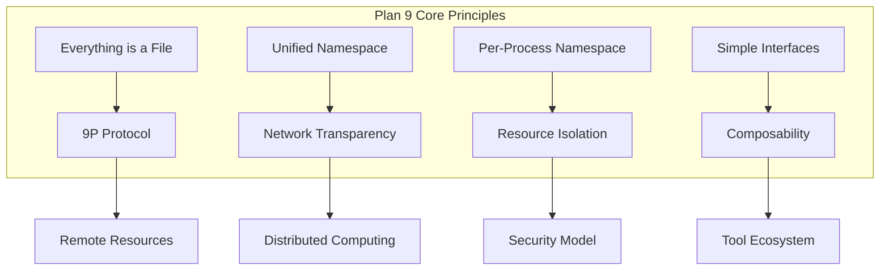

### System Architecture Overview

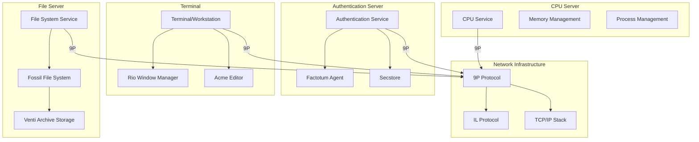

## Kernel Architecture

Plan 9's kernel is designed around the concept of resources as files and processes as the primary abstraction for computation.

### Kernel Structure

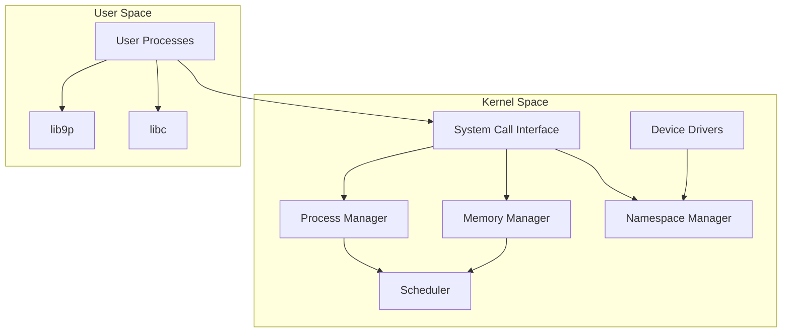

### Process Model

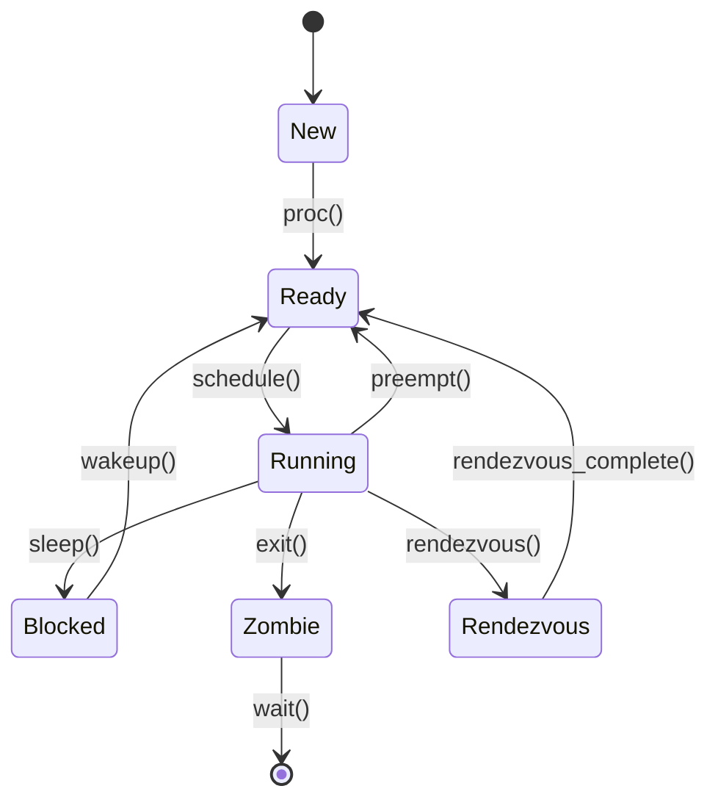

### Memory Management

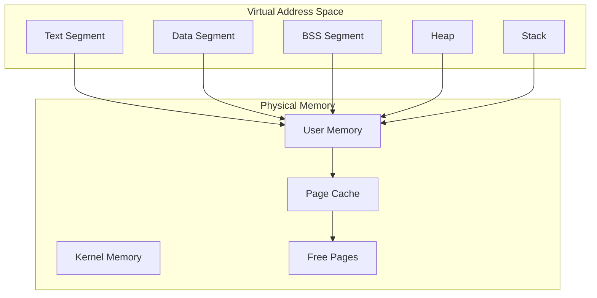

## 9P Protocol

The 9P protocol is the heart of Plan 9's distributed architecture, providing a standard way to access resources over the network.

### 9P Message Flow

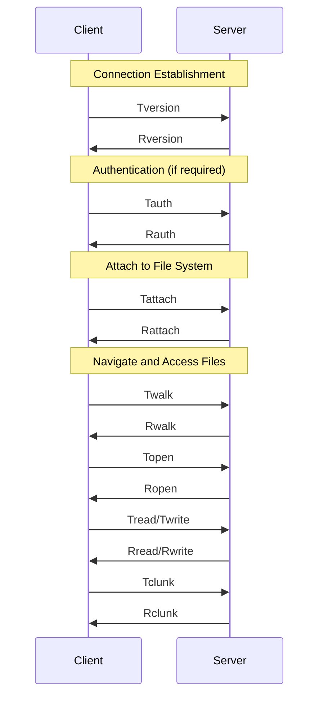

### 9P Protocol Stack

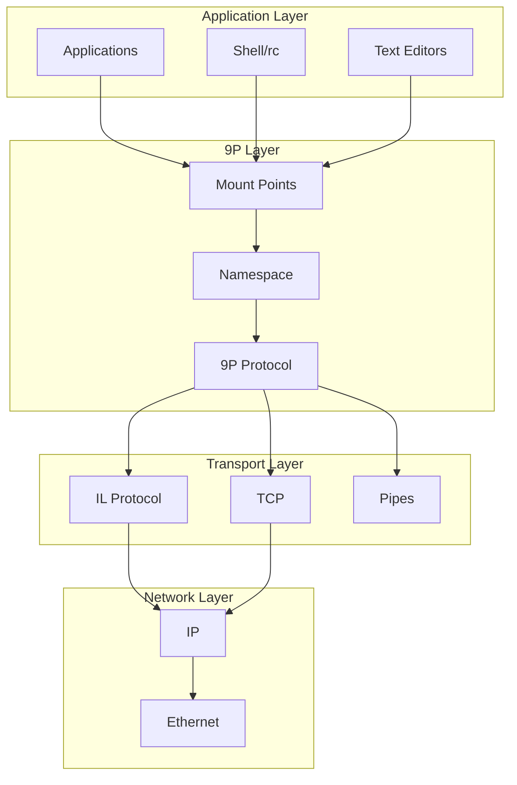

## File Systems

Plan 9 features a sophisticated file system architecture with Fossil providing the active file system and Venti providing archival storage.

### File System Architecture

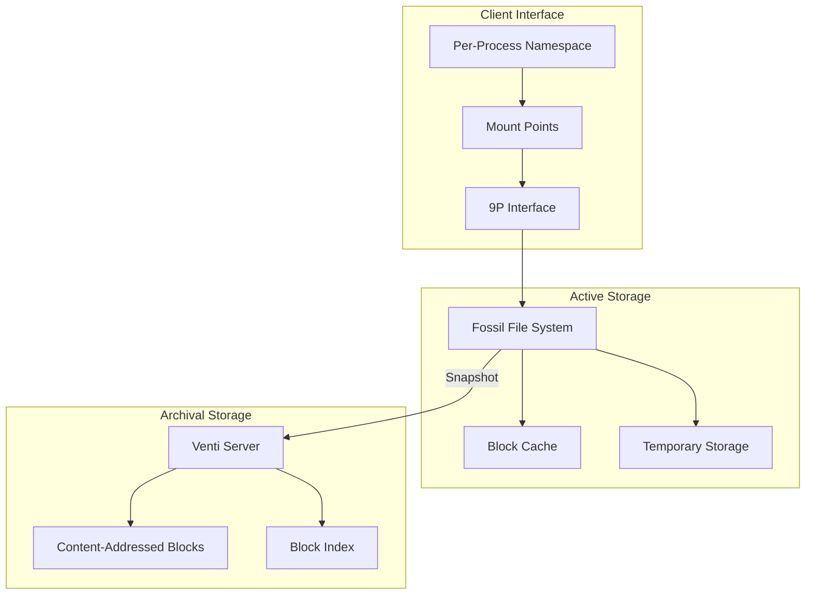

### Fossil Block Structure

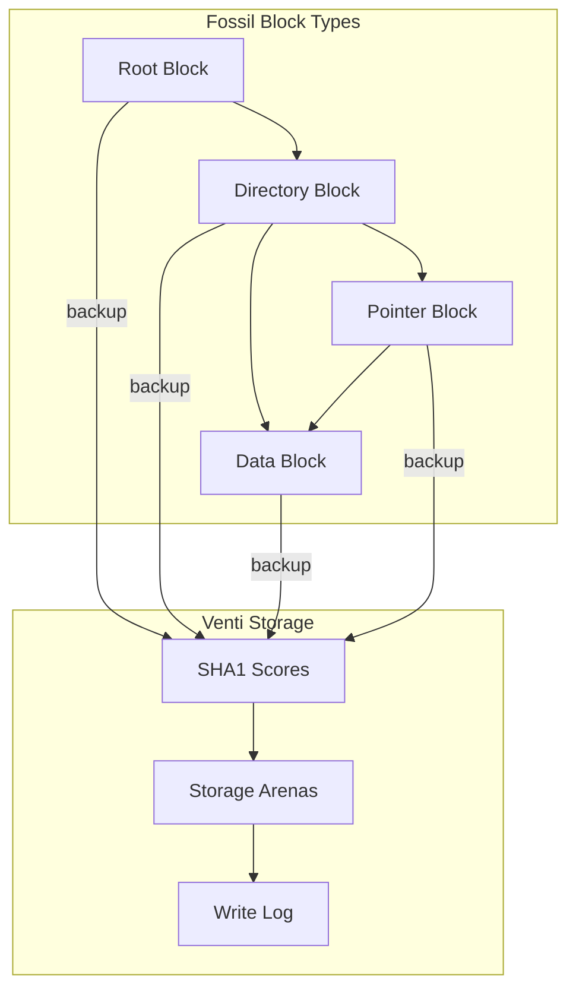

## Authentication & Security

Plan 9's security model is based on capability-style authentication using the factotum agent and a centralized authentication server.

### Authentication Architecture

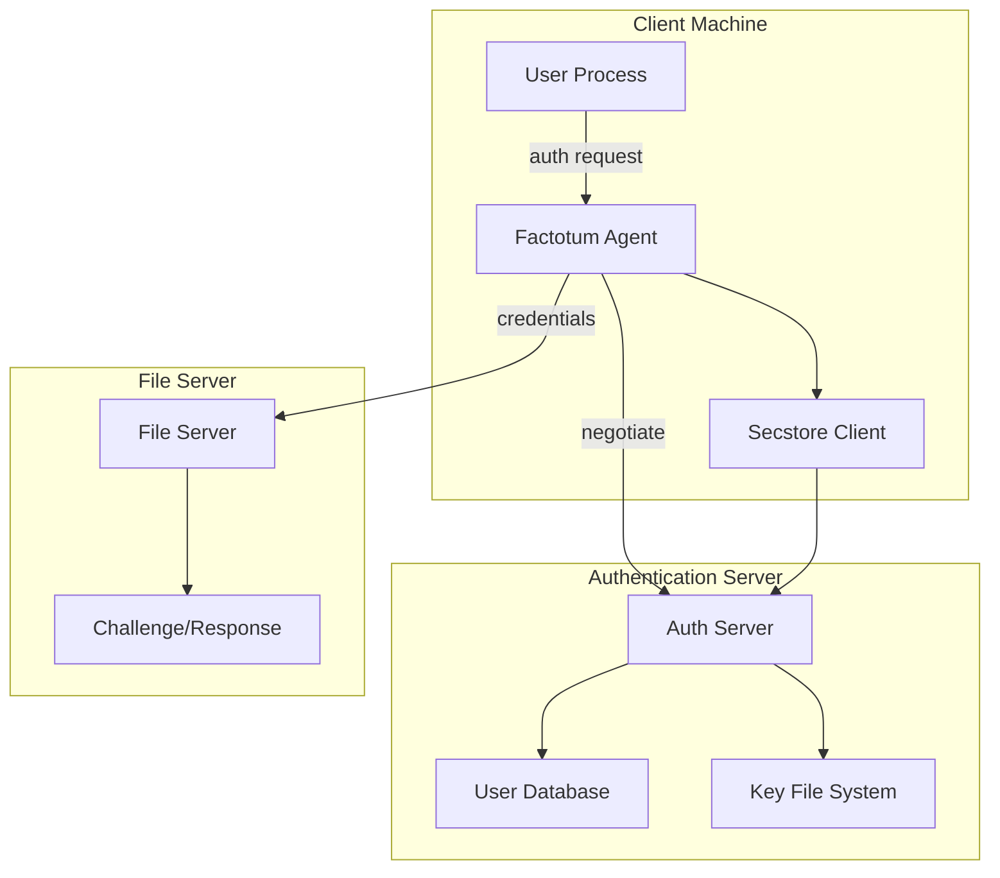

### Security Protocol Flow

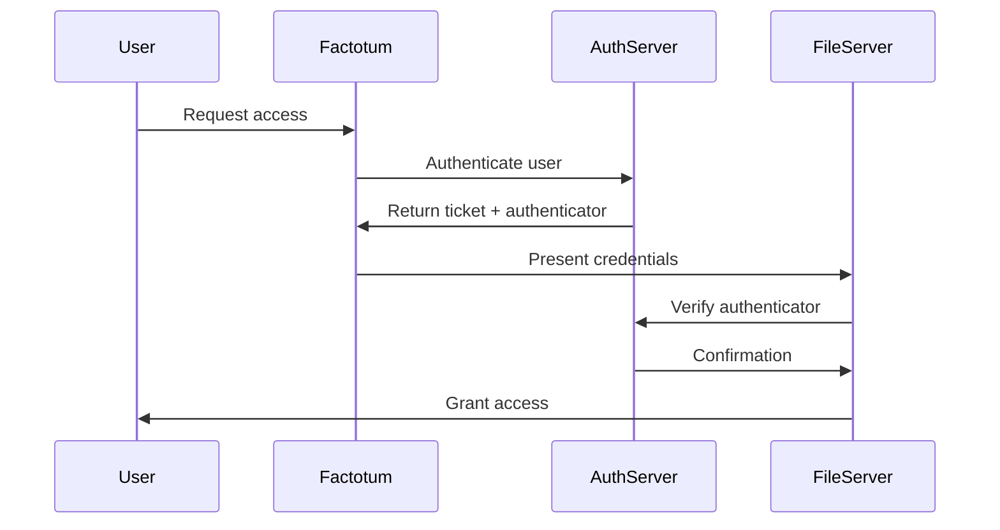

## Networking

Plan 9's networking stack supports both its native IL protocol and standard TCP/IP, with special support for the 9P protocol.

### Network Stack

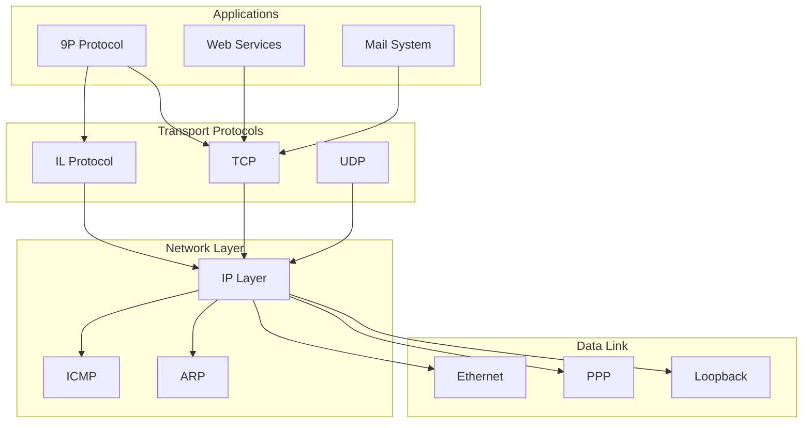

## User Space

Plan 9's user space is built around the shell (rc), window manager (rio), and integrated development environment (acme).

### User Environment

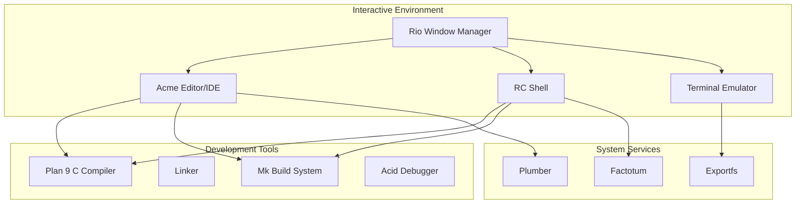

### Plumber Architecture

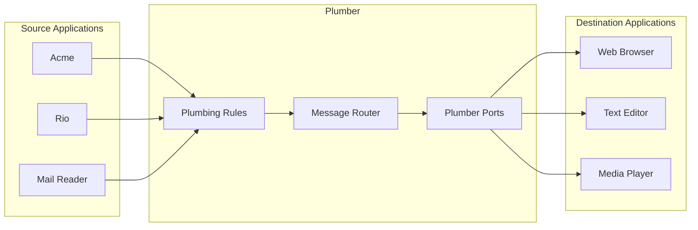

## Development Environment

Plan 9 provides a unique development environment centered around the mk build system and integrated tools.

### Build System Architecture

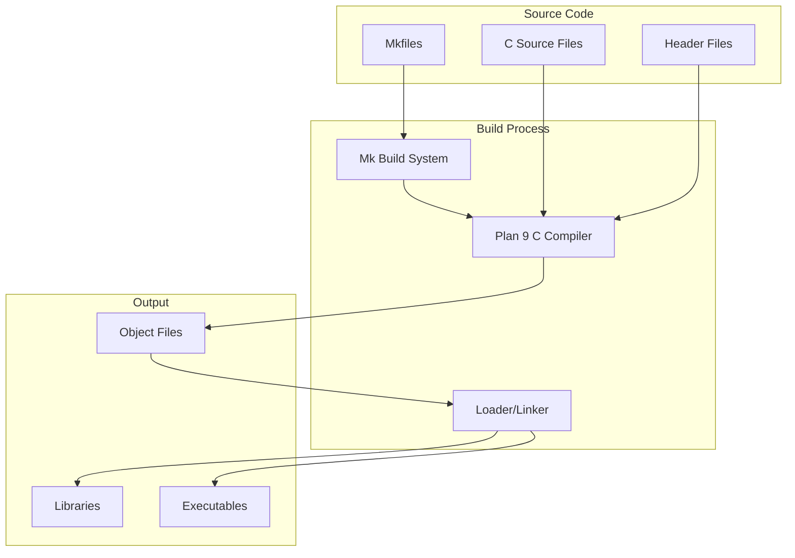

### Library Structure

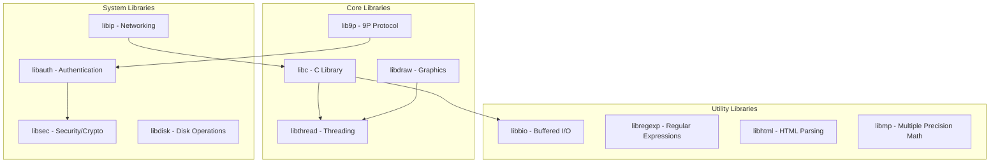

---

*This documentation provides an overview of Plan 9's technical architecture. For detailed implementation information, refer to the papers in `/sys/doc/` and the manual pages in `/sys/man/`.*

## References

- `/sys/doc/9.ms` - Plan 9 from Bell Labs paper
- `/sys/doc/auth.ms` - Security in Plan 9
- `/sys/doc/prog4.ms` - Programming Environment Changes
- `/sys/doc/fossil.ms` - The Fossil File System
- `/sys/doc/venti/` - Venti documentation
- `/sys/man/` - Manual pages for all components