# 9P Protocol Architecture

## Overview

The 9P protocol is Plan 9's distributed file protocol that enables transparent access to resources across the network. It treats all resources as files in a hierarchical namespace.

## Protocol Overview

### 9P Message Types

```mermaid
graph TB
    subgraph "Message Pairs"
        TVERSION[Tversion] --> RVERSION[Rversion]
        TAUTH[Tauth] --> RAUTH[Rauth] 
        TATTACH[Tattach] --> RATTACH[Rattach]
        TWALK[Twalk] --> RWALK[Rwalk]
        TOPEN[Topen] --> ROPEN[Ropen]
        TCREATE[Tcreate] --> RCREATE[Rcreate]
        TREAD[Tread] --> RREAD[Rread]
        TWRITE[Twrite] --> RWRITE[Rwrite]
        TCLUNK[Tclunk] --> RCLUNK[Rclunk]
        TREMOVE[Tremove] --> RREMOVE[Rremove]
        TSTAT[Tstat] --> RSTAT[Rstat]
        TWSTAT[Twstat] --> RWSTAT[Rwstat]
    end
    
    subgraph "Error Handling"
        ERROR[Rerror - Error Response]
    end
    
    TVERSION -.->|"on error"| ERROR
    TAUTH -.->|"on error"| ERROR
    TATTACH -.->|"on error"| ERROR
    TWALK -.->|"on error"| ERROR
    TOPEN -.->|"on error"| ERROR
    TCREATE -.->|"on error"| ERROR
    TREAD -.->|"on error"| ERROR
    TWRITE -.->|"on error"| ERROR
    TCLUNK -.->|"on error"| ERROR
    TREMOVE -.->|"on error"| ERROR
    TSTAT -.->|"on error"| ERROR
    TWSTAT -.->|"on error"| ERROR
```

## Connection Establishment

### Protocol Handshake

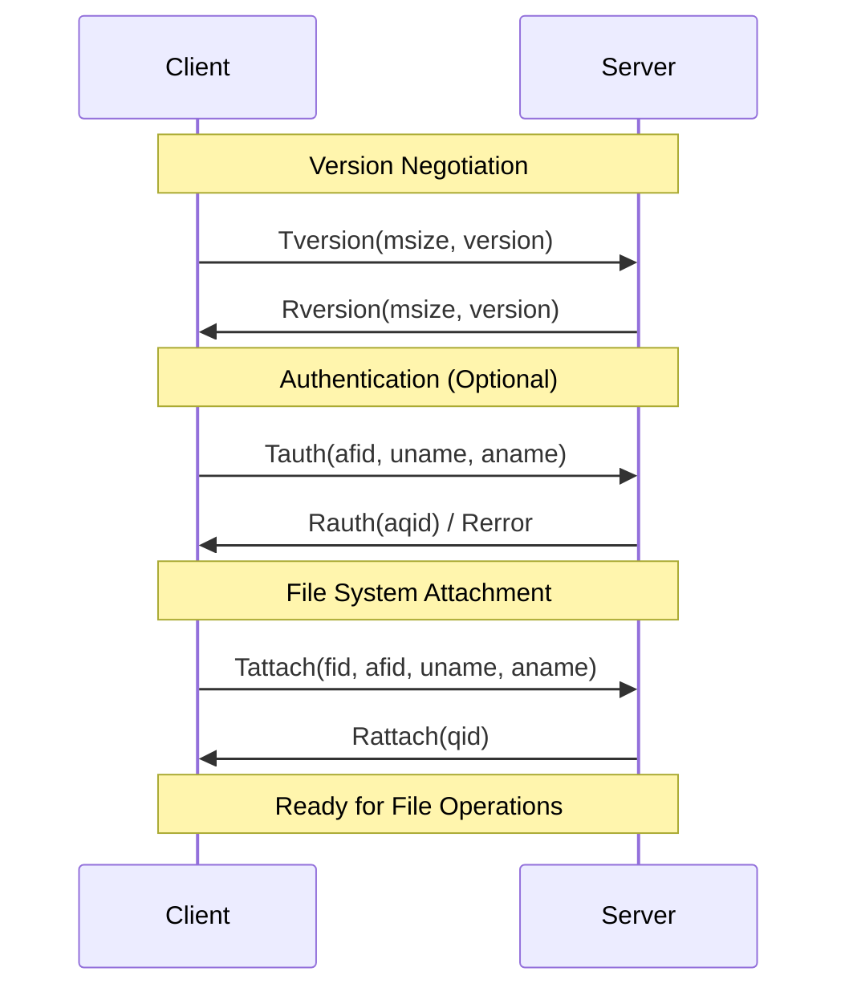

### FID Management

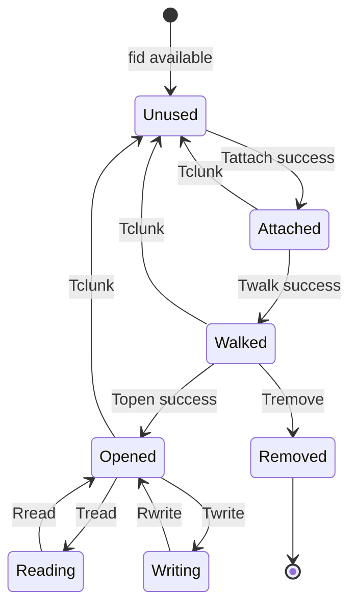

## File Operations

### Directory Walking

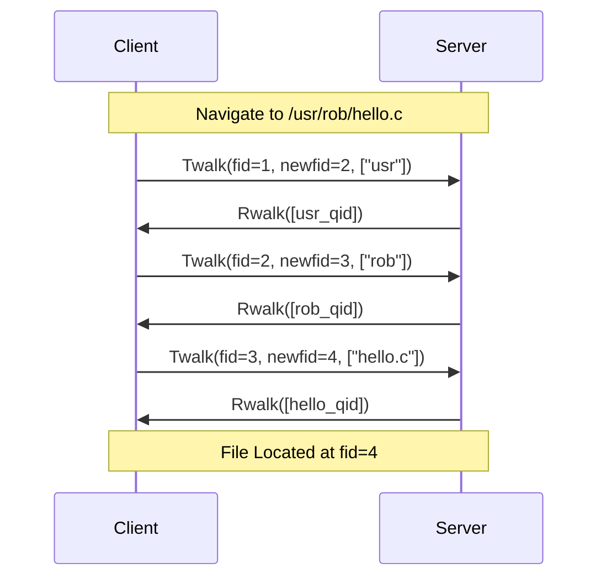

### File I/O Operations

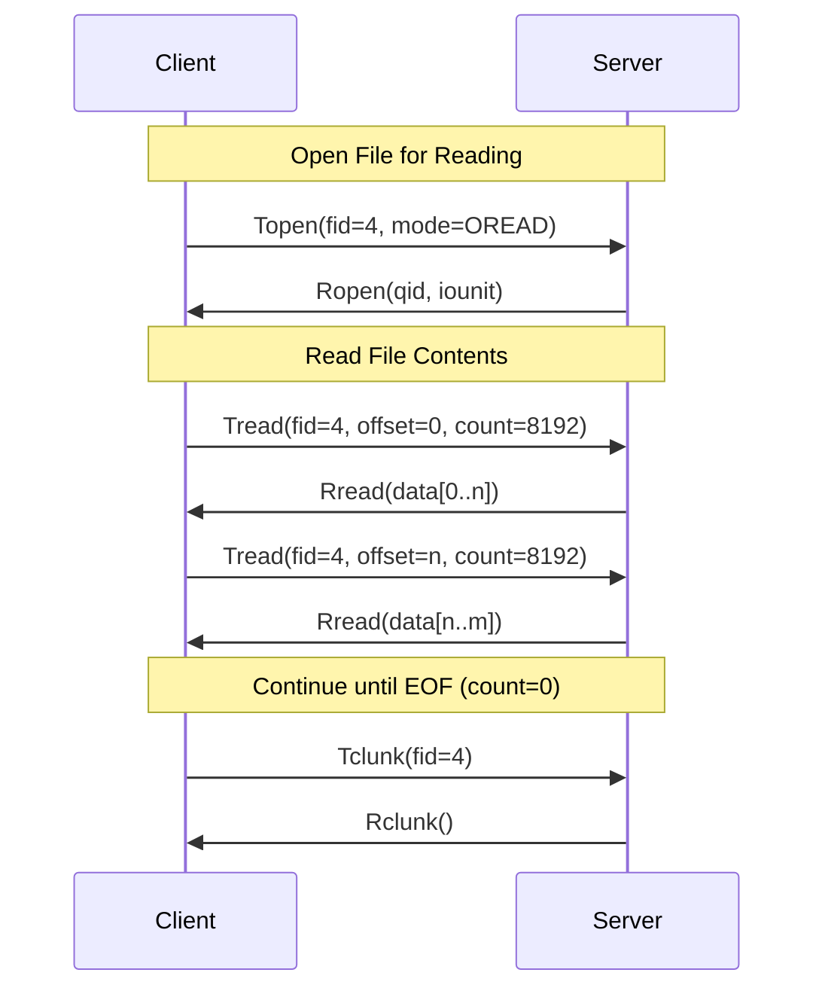

## Message Structure

### 9P Message Format

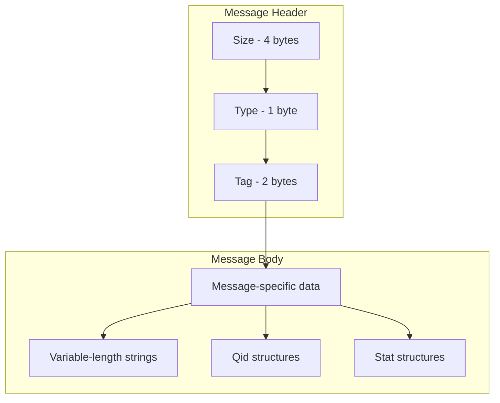

### QID Structure

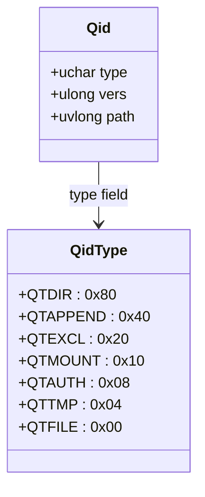

### Stat Structure

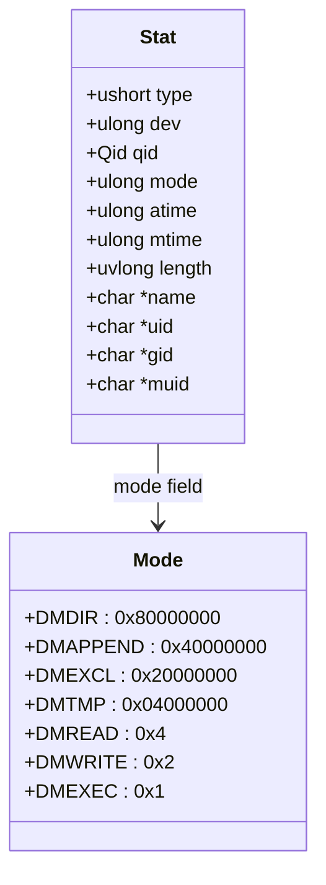

## Protocol Variants

### 9P Versions

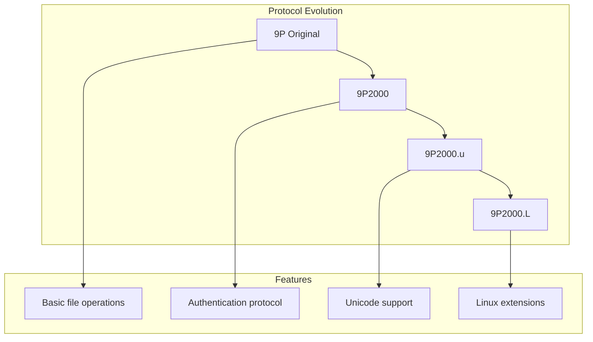

### Transport Protocols

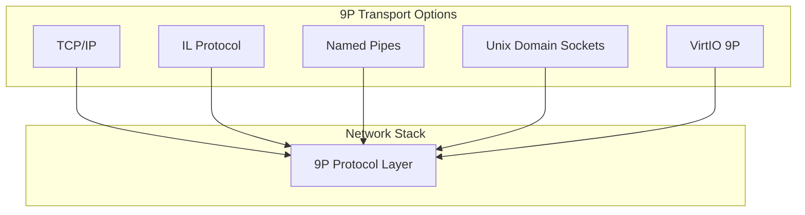

## Security Model

### Authentication Flow

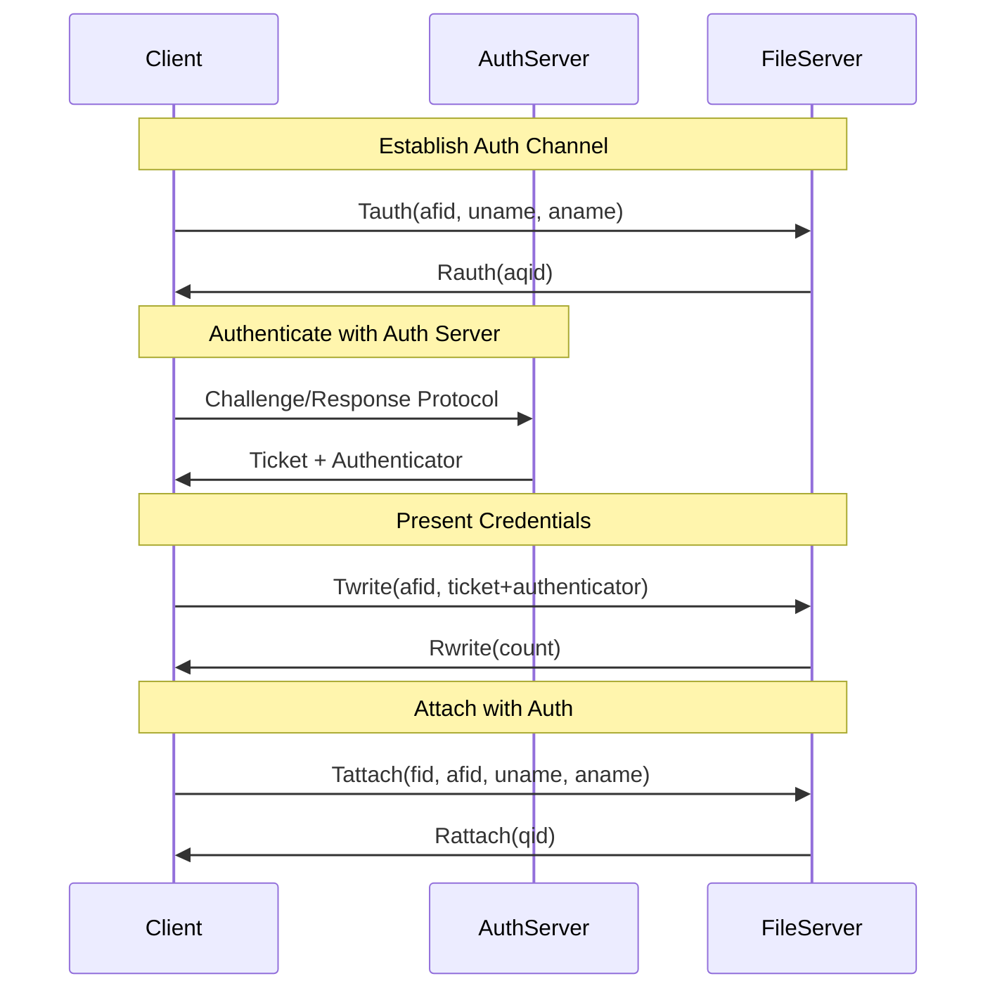

### Permission Model

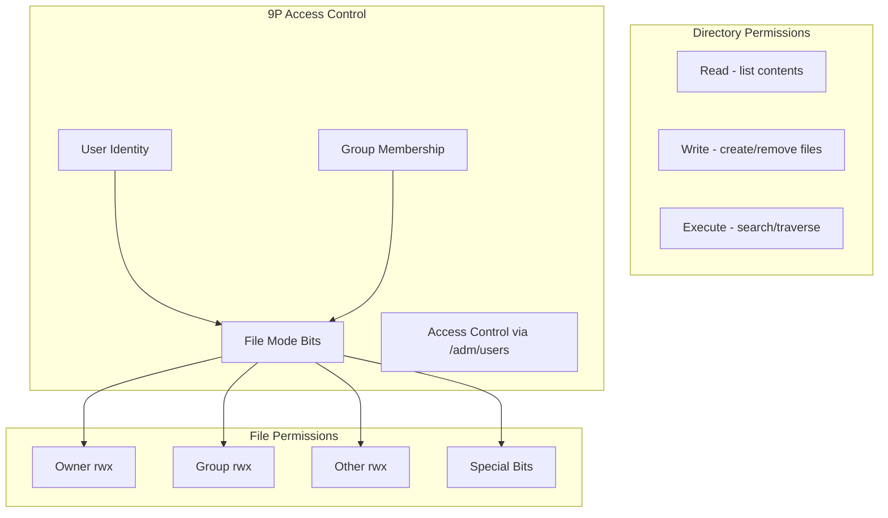

## Implementation Architecture

### Server-Side Components

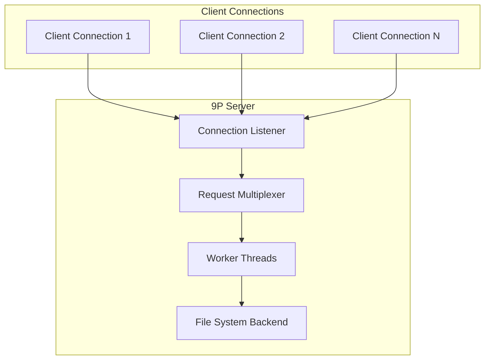

### Client-Side Components

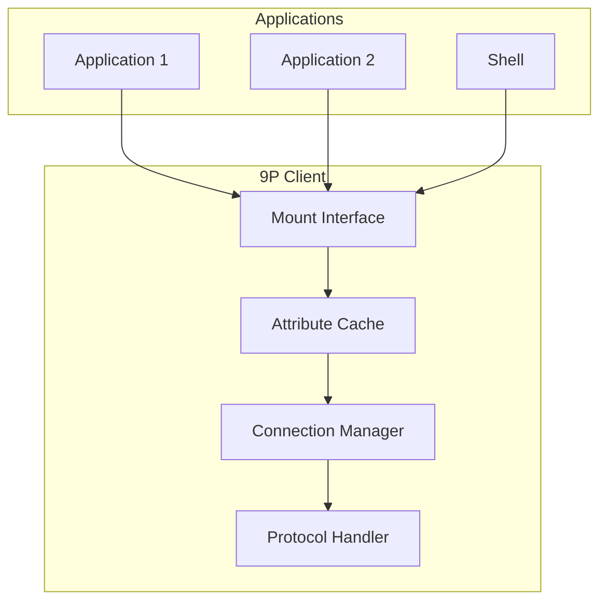

## Performance Considerations

### Message Batching

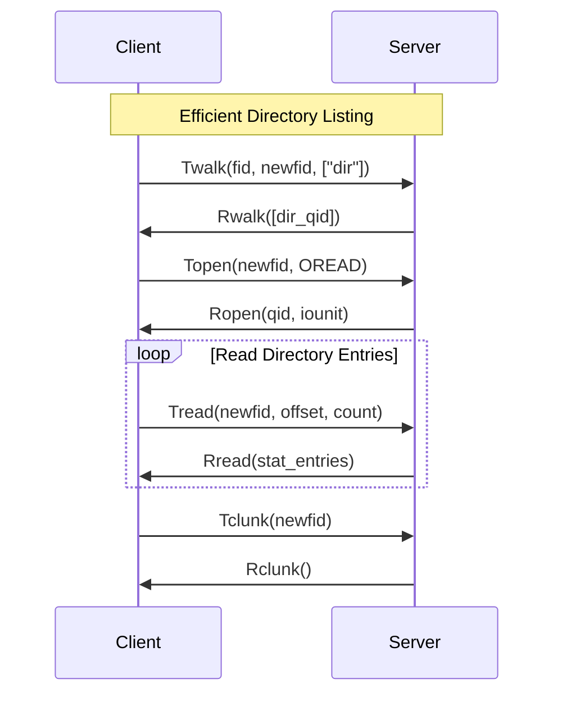

### Caching Strategy

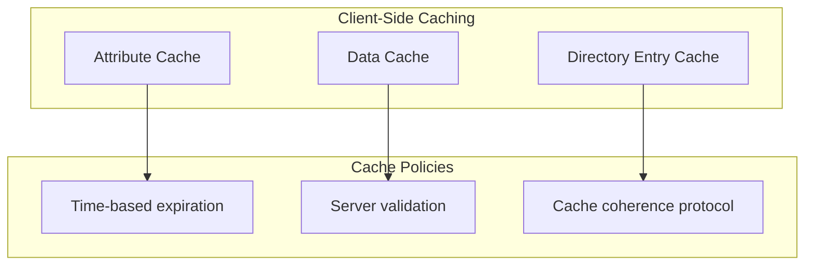

## References

- `/sys/man/5/0intro` - Introduction to file servers
- `/sys/man/5/attach` - 9P attach protocol  
- `/sys/doc/9.ms` - Plan 9 from Bell Labs (9P description)
- `/sys/src/lib9p/` - 9P library implementation
- `RFC` - 9P2000 Protocol Specification