# Plan 9 Deployment and Configuration Guide

## System Architecture Overview

Plan 9 follows a distributed computing model where different services run on specialized servers connected via the 9P protocol.

### Typical Deployment Topology

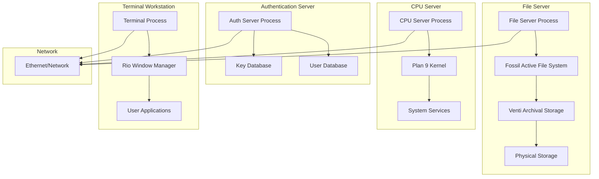

## Server Configuration

### File Server Setup

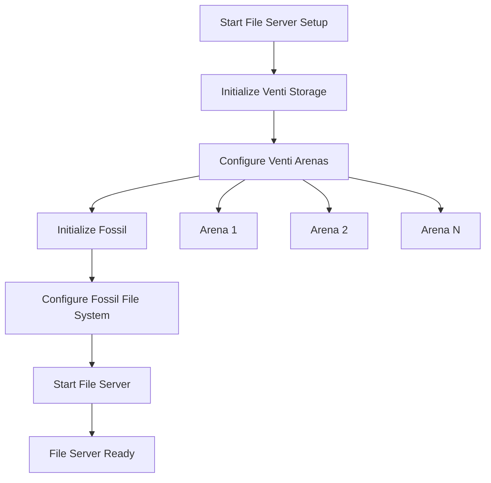

#### File Server Configuration Steps

1. **Venti Storage Setup**
   ```bash
   # Initialize venti storage
   venti/fmtarenas arenas /dev/sdC0/arenas
   venti/fmtisect isect /dev/sdC0/isect
   venti/fmtindex index /dev/sdC0/index isect
   ```

2. **Fossil File System Setup**
   ```bash
   # Initialize fossil
   fossil/flfmt -v /dev/sdC0/fossil
   # Start fossil with venti backend
   fossil/fossil -f /dev/sdC0/fossil -c 'srv fossil' -c 'srv fscons'
   ```

### Authentication Server Setup

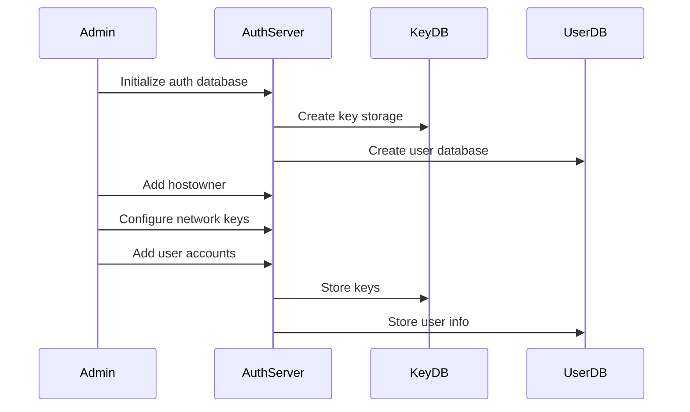

#### Authentication Configuration

```bash
# Initialize authentication database
auth/keyfs -wp -m /mnt/keys /adm/keys
auth/changeuser -p glenda

# Add authentication server to network
echo 'auth=192.168.1.1' >> /lib/ndb/local

# Start authentication services  
auth/authsrv tcp!*!567
```

### CPU Server Configuration

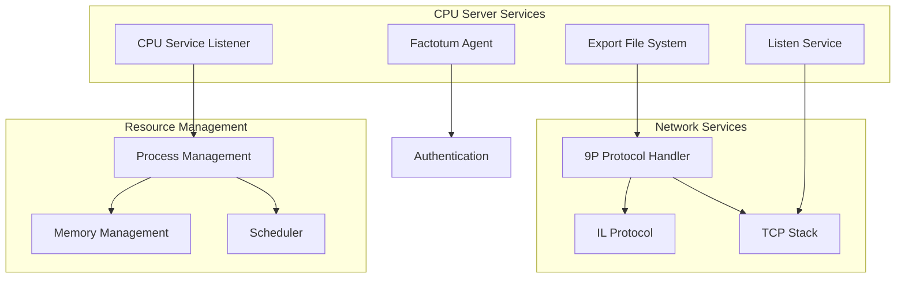

## Network Configuration

### Network Database Configuration

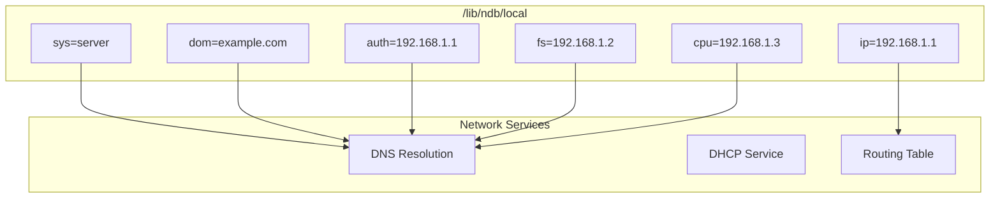

### Sample Network Configuration

```
# /lib/ndb/local
sys=auth dom=example.com ip=192.168.1.1
    auth=auth
    
sys=fs dom=example.com ip=192.168.1.2
    fs=fs
    
sys=cpu dom=example.com ip=192.168.1.3  
    cpu=cpu
    
sys=term dom=example.com ip=192.168.1.100
    
ipnet=example ip=192.168.1.0 ipmask=255.255.255.0
    ipgw=192.168.1.1
    dns=192.168.1.1
```

## Service Management

### Boot Process Flow

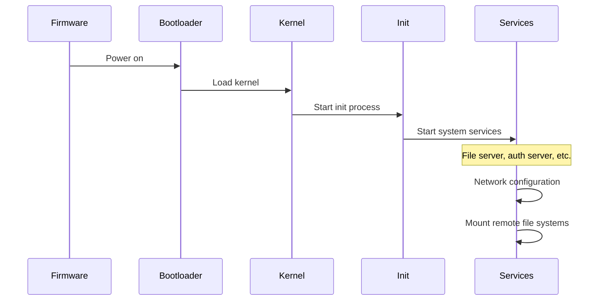

### Service Dependencies

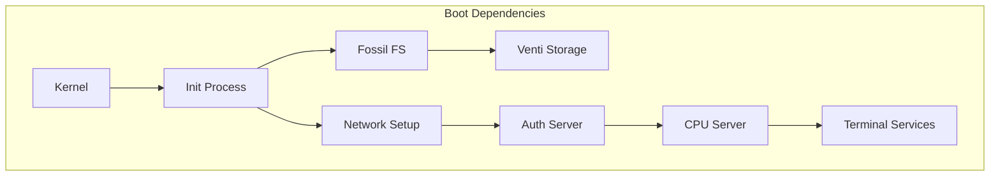

## User Environment Setup

### Terminal Configuration

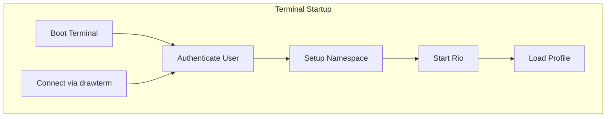

### Namespace Configuration

```mermaid
graph TB
    subgraph "Default Namespace"
        ROOT[/ - Root]
        BIN[/bin - Binaries]
        USR[/usr - User Files]
        TMP[/tmp - Temporary]
        PROC[/proc - Processes]
        NET[/net - Network]
        ENV[/env - Environment]
    end
    
    subgraph "User Namespace"
        HOME[/usr/$user - Home Directory]
        BIN_USER[/bin - User Binaries]
        LIB_USER[/lib - User Libraries]
    end
    
    ROOT --> BIN
    ROOT --> USR
    ROOT --> TMP
    ROOT --> PROC
    ROOT --> NET
    ROOT --> ENV
    USR --> HOME
    HOME --> BIN_USER
    HOME --> LIB_USER
```

## Storage Configuration

### Fossil + Venti Architecture

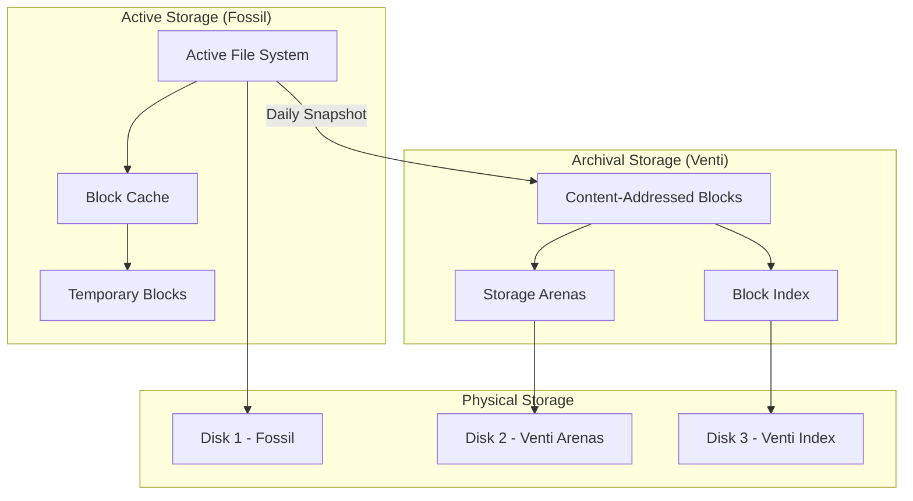

### Storage Partitioning

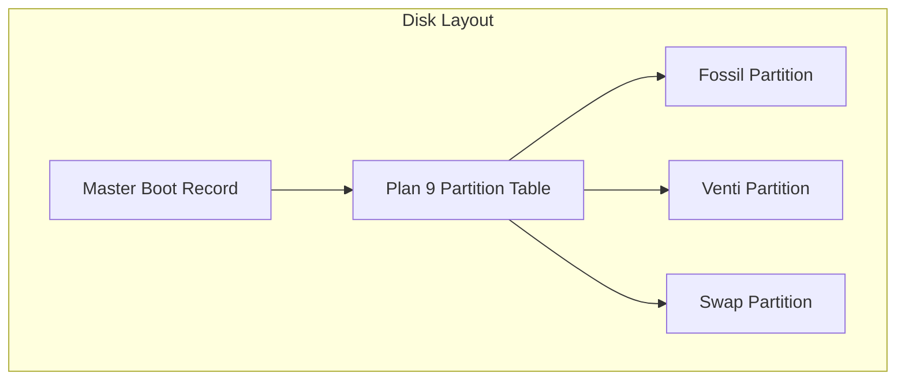

## Security Configuration

### Authentication Flow

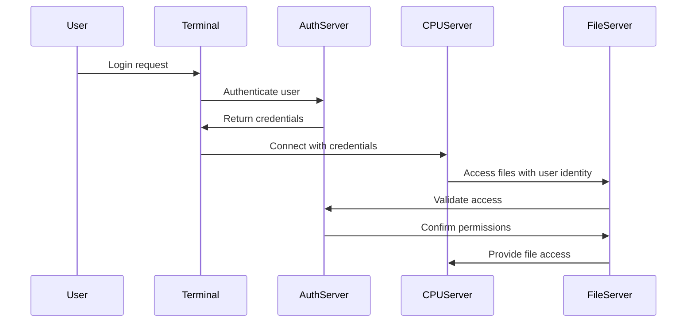

### Factotum Configuration

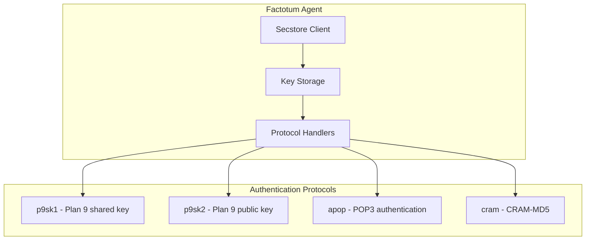

## Monitoring and Maintenance

### System Monitoring

```mermaid
graph TB
    subgraph "Monitoring Tools"
        STATS[/proc/stats]
        PS[ps - Process list]
        WHO[who - Active users]
        NETSTAT[netstat - Network status]
    end
    
    subgraph "Log Files"
        FOSSIL_LOG[Fossil console log]
        VENTI_LOG[Venti log]
        AUTH_LOG[Authentication log]
        SYSTEM_LOG[System console]
    end
    
    STATS --> SYSTEM_LOG
    PS --> SYSTEM_LOG
    WHO --> AUTH_LOG
    NETSTAT --> SYSTEM_LOG
```

### Backup Strategy

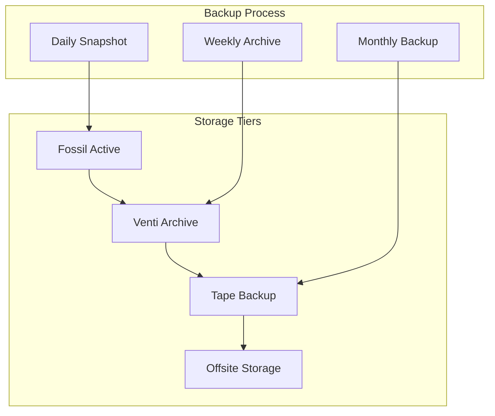

## Troubleshooting

### Common Issues

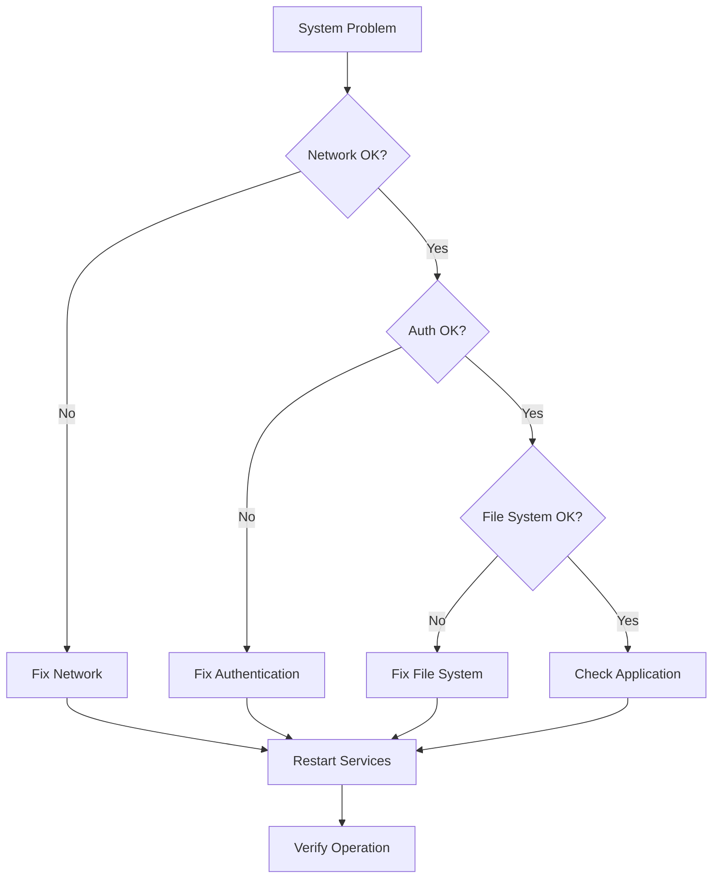

### Diagnostic Commands

| Issue | Command | Description |
|-------|---------|-------------|
| Network | `ip/ping host` | Test connectivity |
| Authentication | `auth/debug` | Debug auth issues |
| File System | `fossil/conf` | Check fossil status |
| Processes | `ps -a` | List all processes |
| Memory | `cat /proc/swap` | Check swap usage |

## References

- `/sys/doc/` - System documentation
- `/sys/man/8/` - System administration manual pages  
- `/sys/man/4/` - Device and file system manual pages
- `/lib/namespace*` - Namespace configuration files
- `/rc/bin/cpurc` - CPU server startup script
- `/rc/bin/termrc` - Terminal startup script