# Plan 9 Development Environment

## Overview

Plan 9 provides an integrated development environment centered around the Acme editor, mk build system, and a collection of programming tools designed for simplicity and composability.

## Development Tools Overview

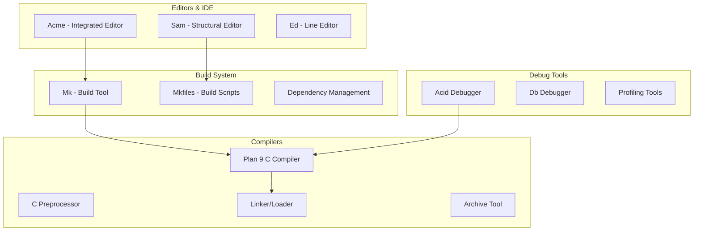

## Acme Editor

### Architecture

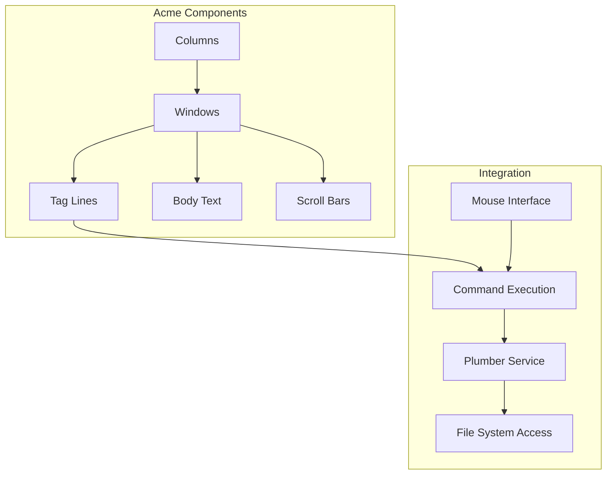

### Window Management

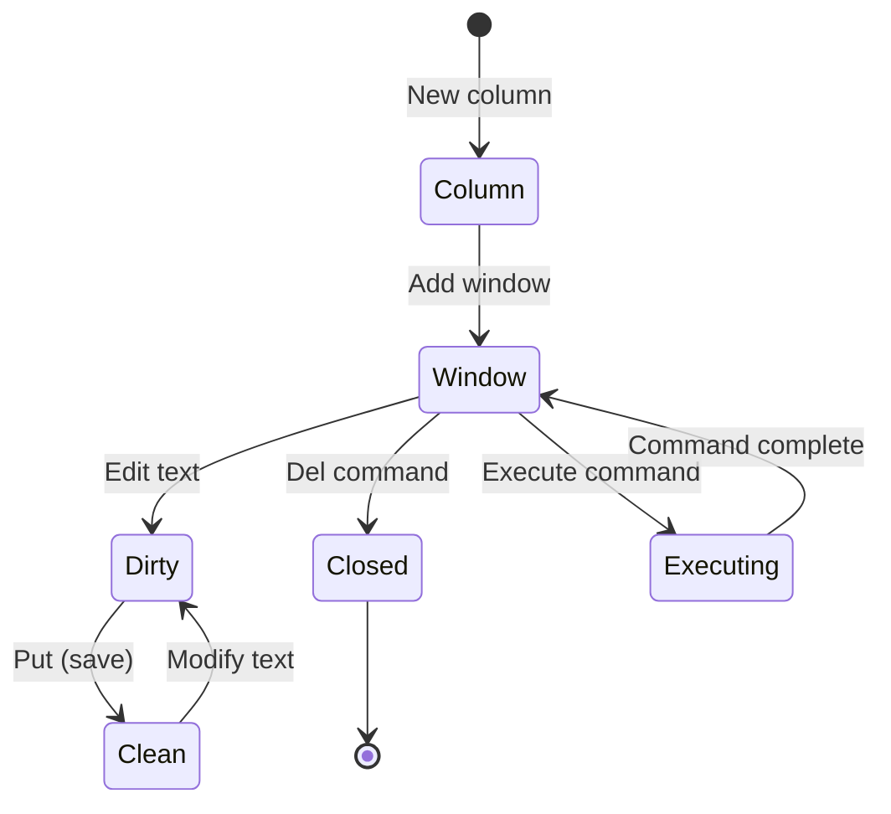

### Command Integration

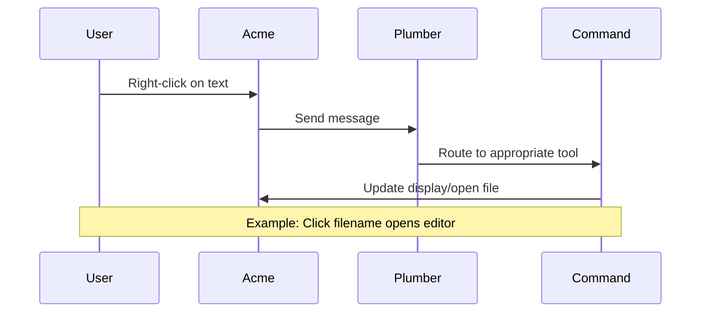

## Build System (Mk)

### Mkfile Structure

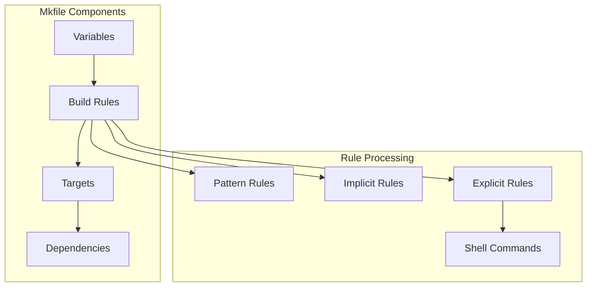

### Build Process Flow

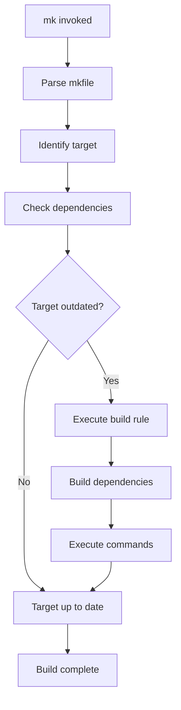

### Example Mkfile

```makefile
<mkconfig

TARG=hello
OFILES=hello.$O

</sys/src/cmd/mkone

hello.$O: hello.c
        $CC $CFLAGS hello.c
```

## C Compiler Suite

### Compiler Architecture

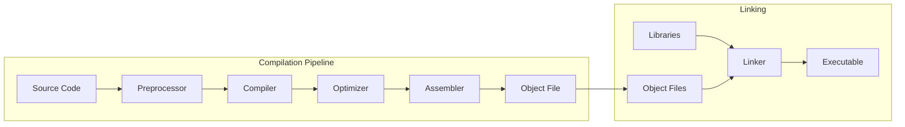

### Cross-Compilation Support

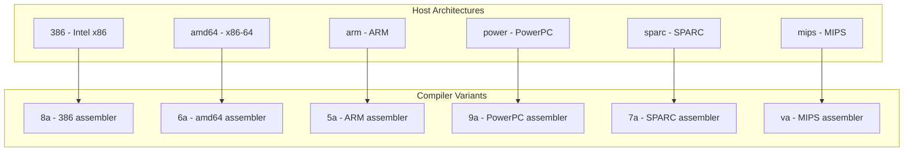

### Library Structure

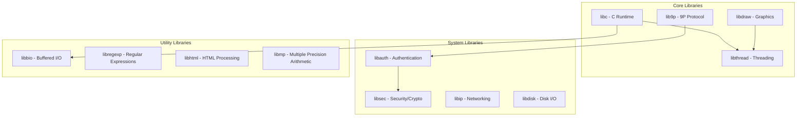

## Debugging Environment

### Acid Debugger

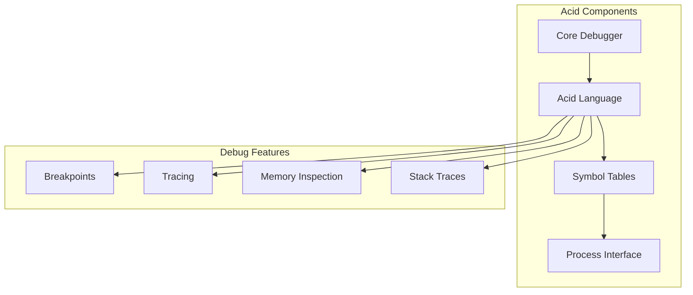

### Debugging Workflow

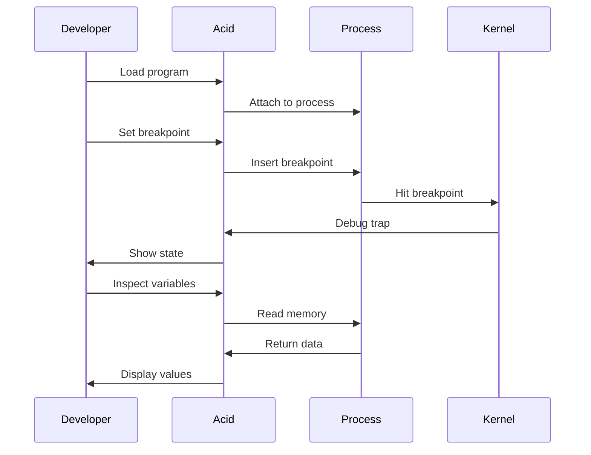

## Programming Environment

### Source Code Organization

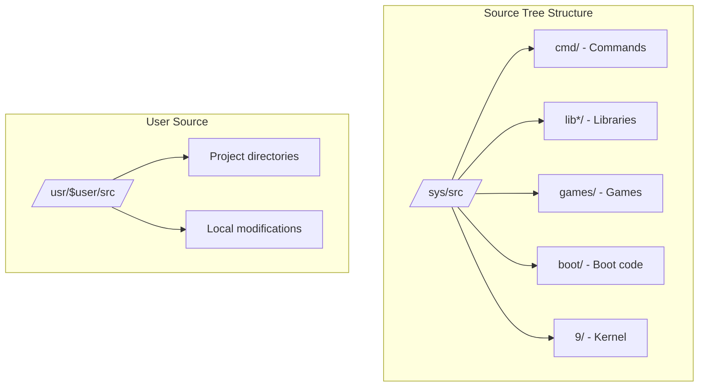

### Development Workflow

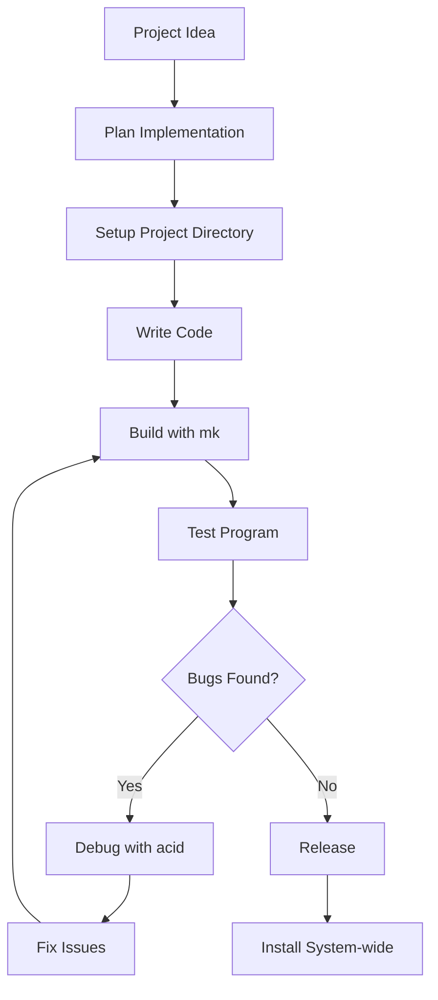

## Text Processing Tools

### Sam Editor

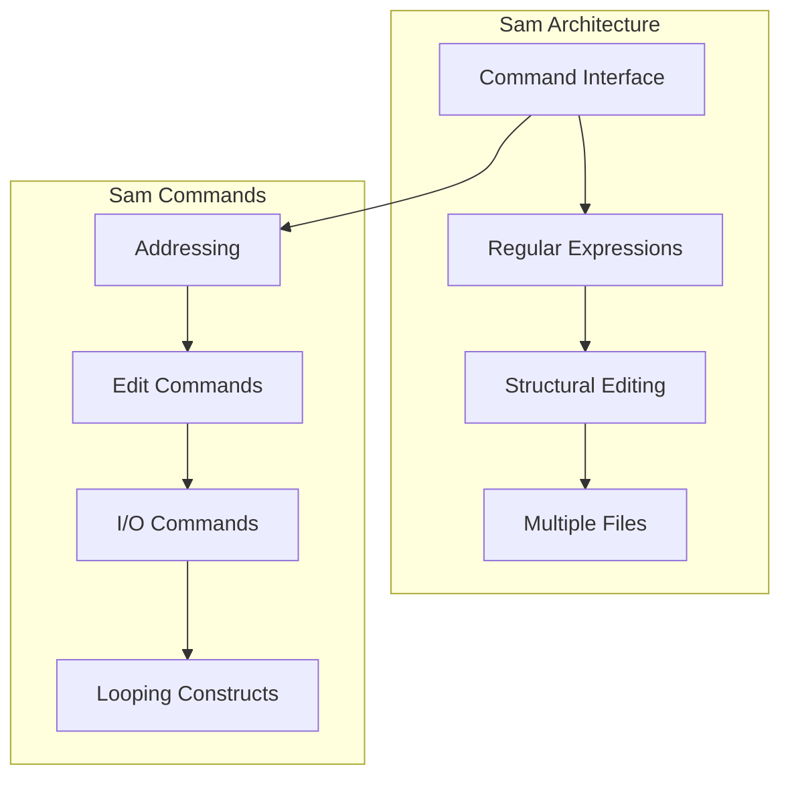

### Text Processing Pipeline

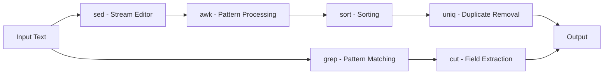

## Version Control Integration

### Source Management

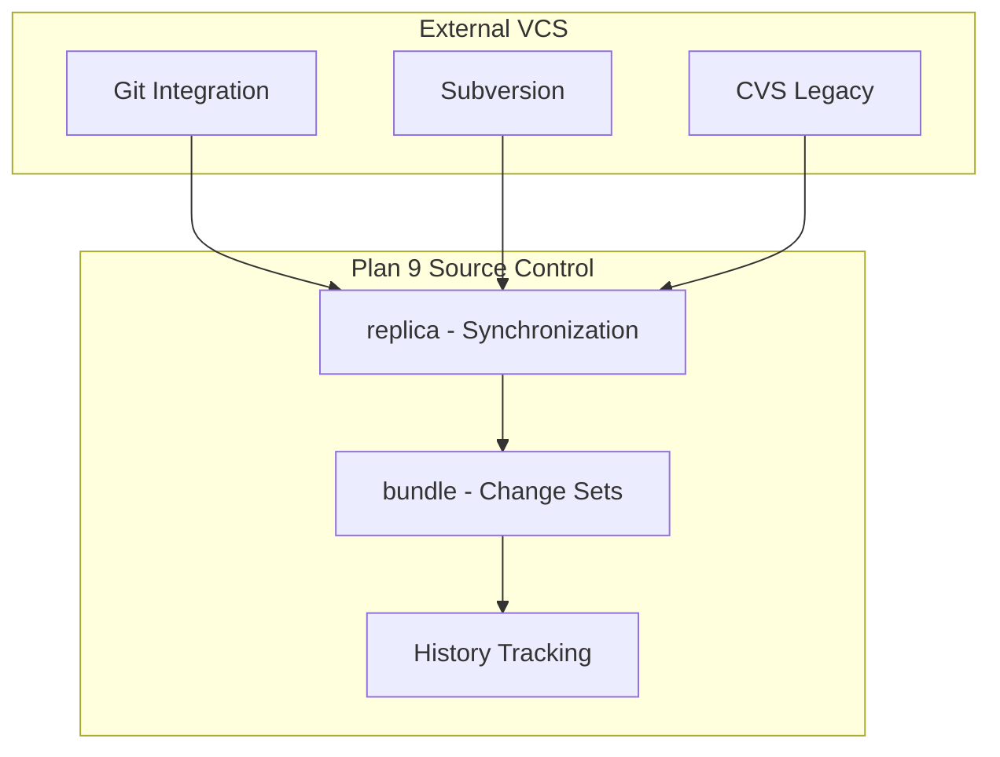

## Plumber System

### Message Routing

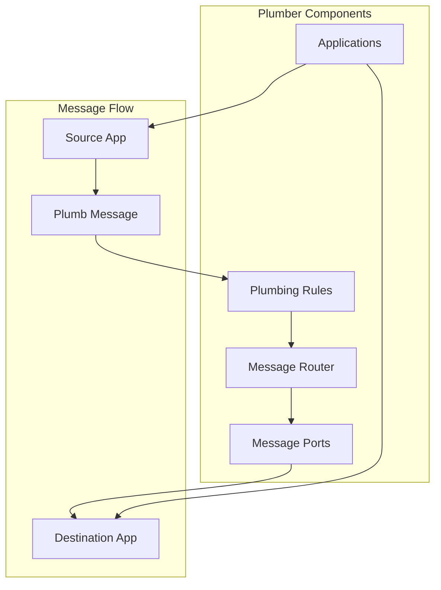

### Plumbing Rules

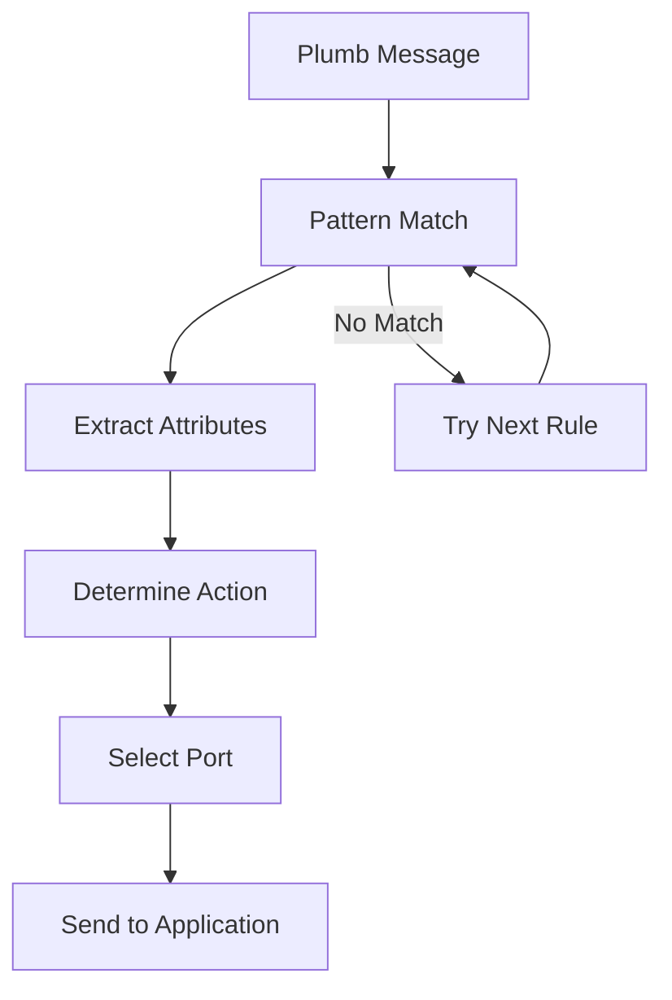

## Performance Tools

### Profiling Infrastructure

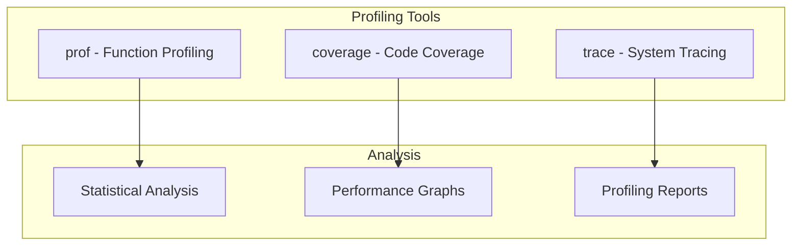

## Integration with System

### Development Services

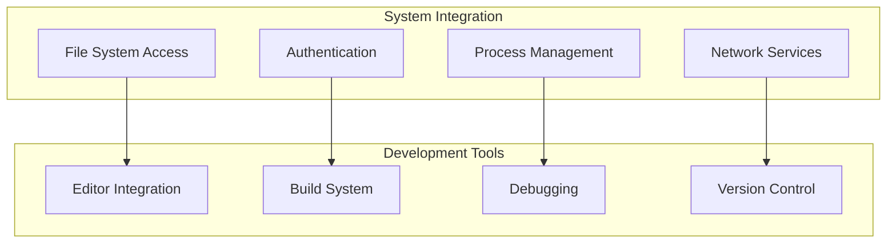

### Cross-Platform Development

```mermaid
graph TB
    subgraph "Target Platforms"
        PLAN9[Plan 9 Native]
        UNIX[Unix/Linux]
        WINDOWS[Windows]
        EMBEDDED[Embedded Systems]
    end
    
    subgraph "Portability Tools"
        APE[APE - ANSI/POSIX Environment]
        CROSS[Cross Compilers]
        EMULATION[Emulation Layer]
    end
    
    PLAN9 --> CROSS
    UNIX --> APE
    WINDOWS --> EMULATION
    EMBEDDED --> CROSS
```

## Configuration and Customization

### Environment Setup

```bash
# Development environment variables
PLAN9=/
PATH=$PLAN9/bin:$PATH
objtype=386
cputype=386

# Editor preferences  
font=/lib/font/bit/lucidasans/typesetter.6.font
acmeshell=rc
```

### Custom Build Rules

```makefile
# Custom mkfile template
<mkconfig

TARG=myprogram
OFILES=\
    main.$O\
    module1.$O\
    module2.$O\

HFILES=\
    myprogram.h\
    internal.h\

</sys/src/cmd/mkone

myprogram.h: generate.c
    $CC -o generate generate.c
    ./generate > myprogram.h
```

## Best Practices

### Code Organization

```mermaid
graph TB
    subgraph "Project Structure"
        ROOT[Project Root]
        SRC[src/ - Source files]
        INCLUDE[include/ - Headers]
        DOC[doc/ - Documentation] 
        TEST[test/ - Test cases]
        MKFILE[mkfile - Build script]
    end
    
    ROOT --> SRC
    ROOT --> INCLUDE
    ROOT --> DOC
    ROOT --> TEST
    ROOT --> MKFILE
```

### Development Cycle

1. **Planning**: Design interfaces and data structures
2. **Implementation**: Write code in small, testable modules  
3. **Testing**: Use built-in test framework
4. **Documentation**: Document interfaces and usage
5. **Integration**: Ensure compatibility with Plan 9 conventions
6. **Performance**: Profile and optimize critical paths

## References

- `/sys/doc/acme/` - Acme documentation
- `/sys/doc/sam/` - Sam editor documentation  
- `/sys/doc/mk.ms` - Mk build system
- `/sys/doc/compiler.ms` - Plan 9 C compiler
- `/sys/doc/acidpaper.ms` - Acid debugger
- `/sys/man/1/` - User command manual pages
- `/sys/src/` - System source code examples