# Plan 9 File System Architecture

## Overview

Plan 9's file system architecture consists of two main components: Fossil for active storage and Venti for archival storage. This design provides both high-performance access to current data and reliable long-term storage.

## Fossil File System

### Architecture Overview

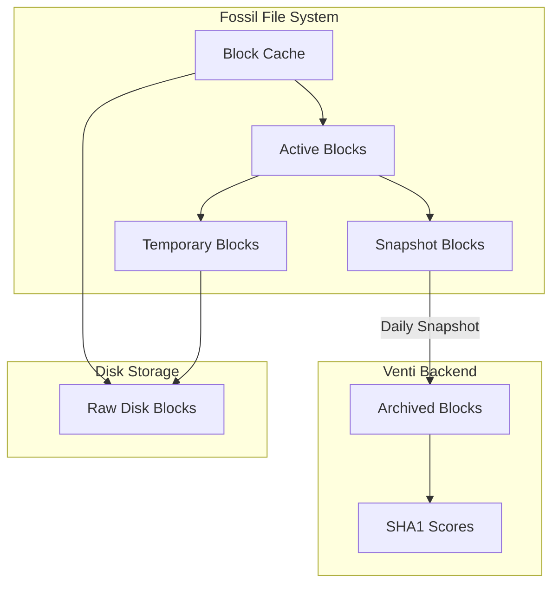

### Block Types

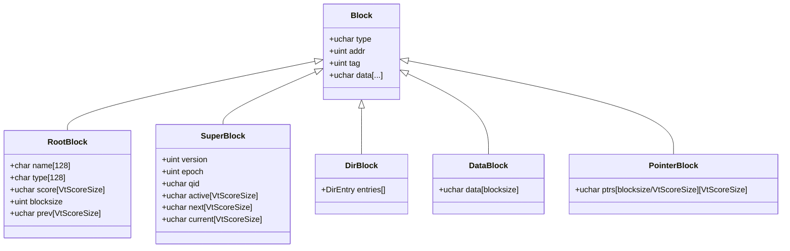

### File Structure

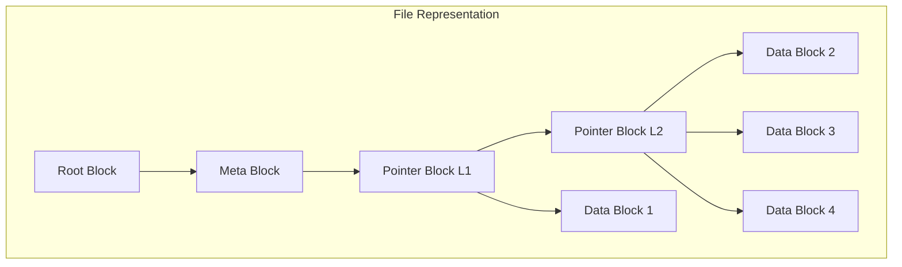

### Directory Structure

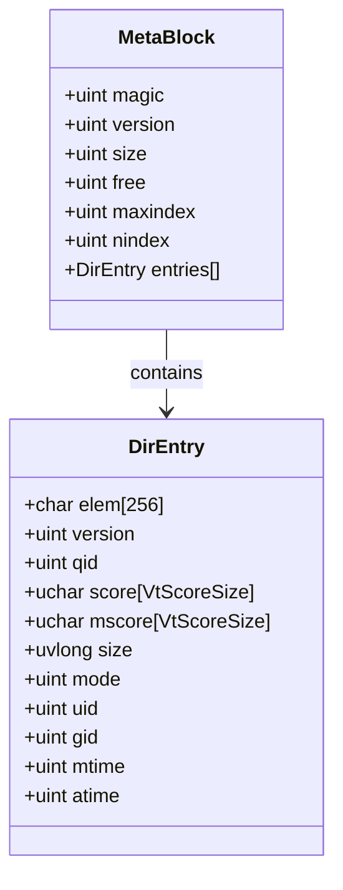

## Venti Archive Storage

### Content-Addressed Storage

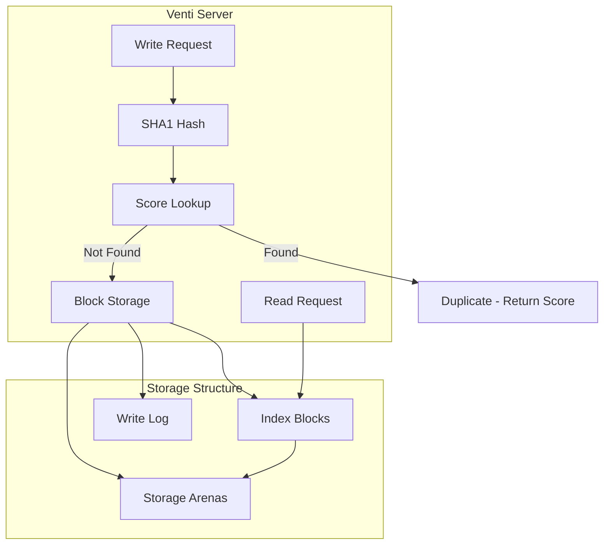

### Block Types in Venti

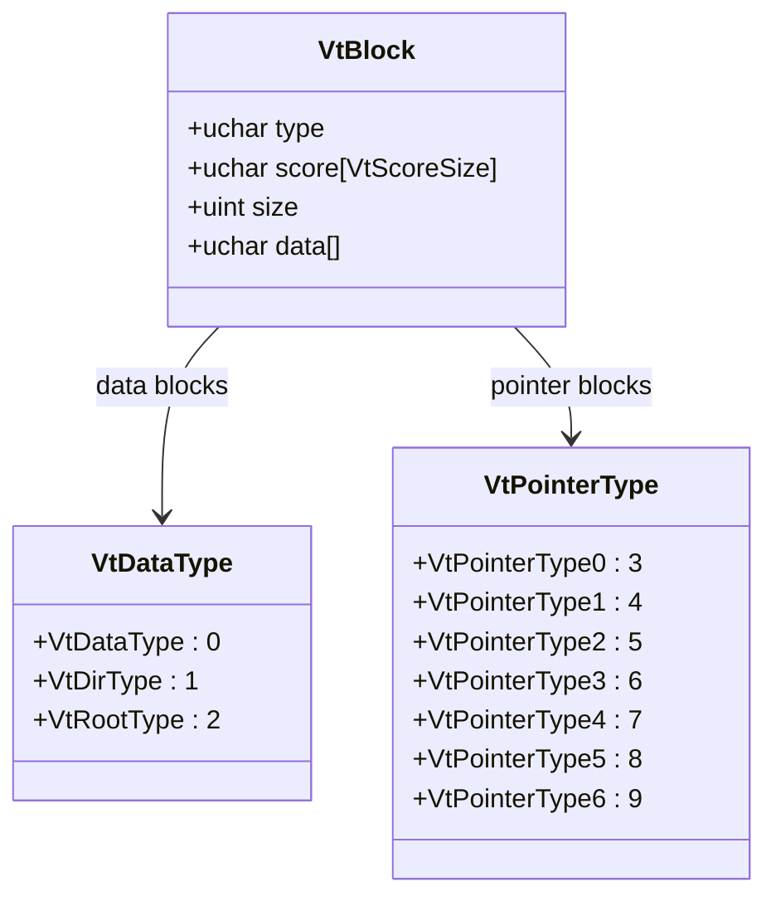

### Arena Structure

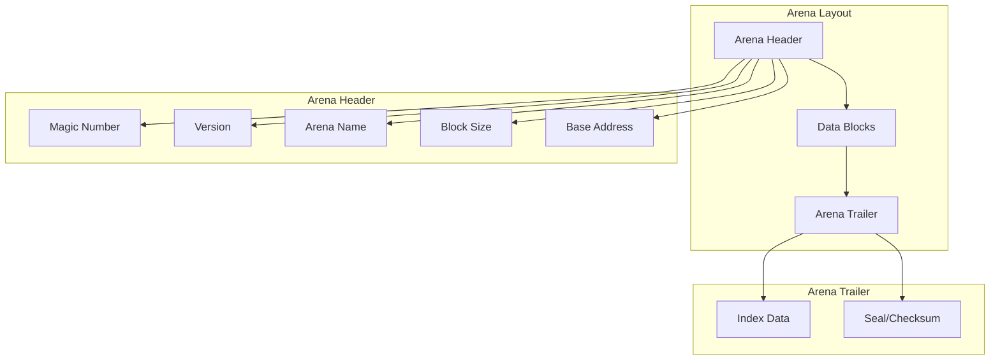

## File Operations

### Read Operation Flow

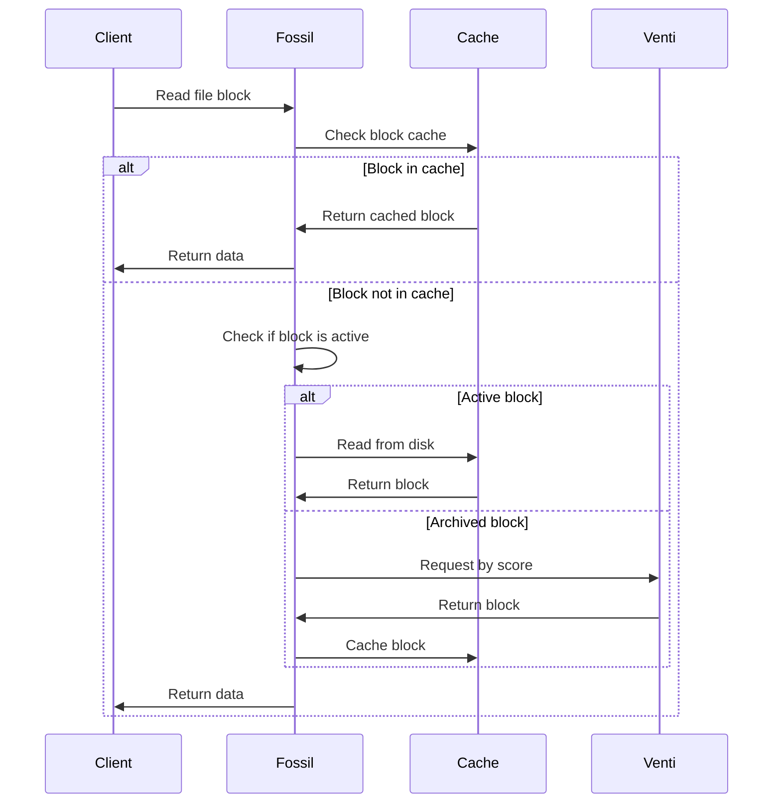

### Write Operation Flow

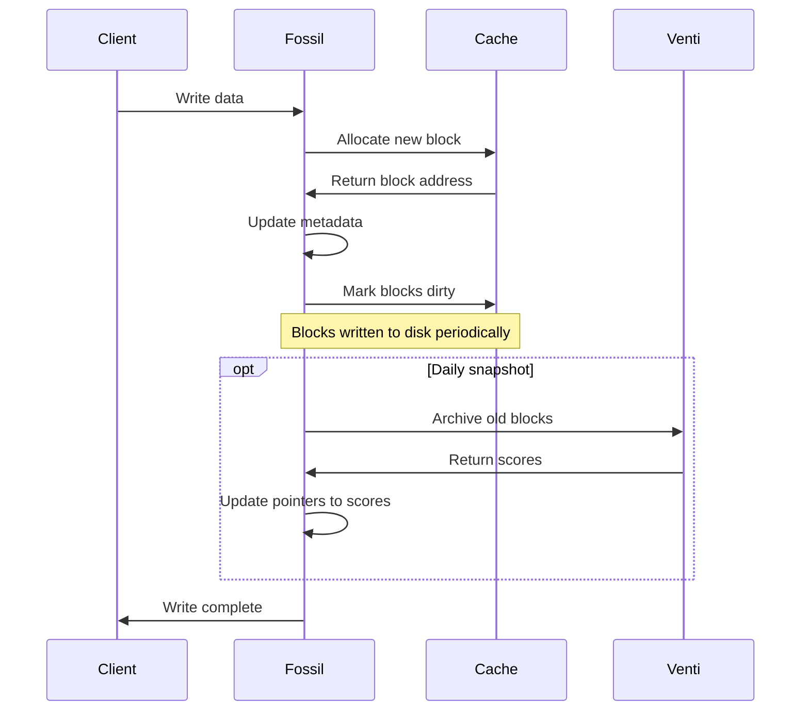

## Snapshots and Versioning

### Snapshot Mechanism

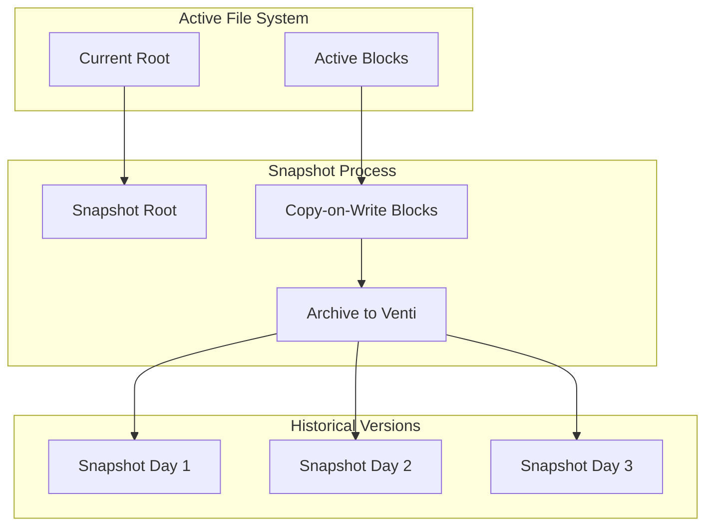

### Copy-on-Write

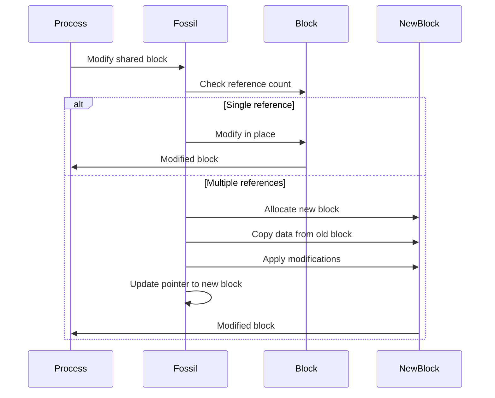

## Performance Optimization

### Caching Strategy

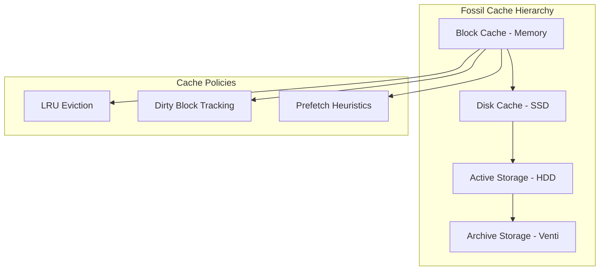

### I/O Optimization

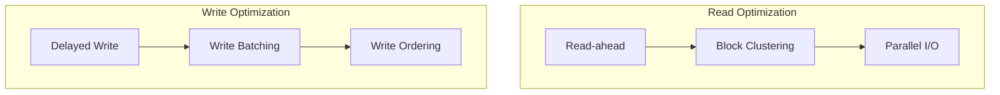

## File System Consistency

### Consistency Model

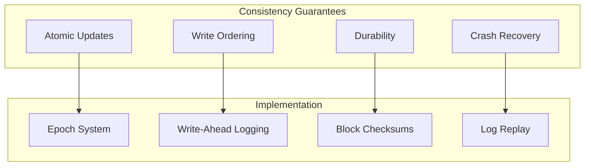

### Recovery Process

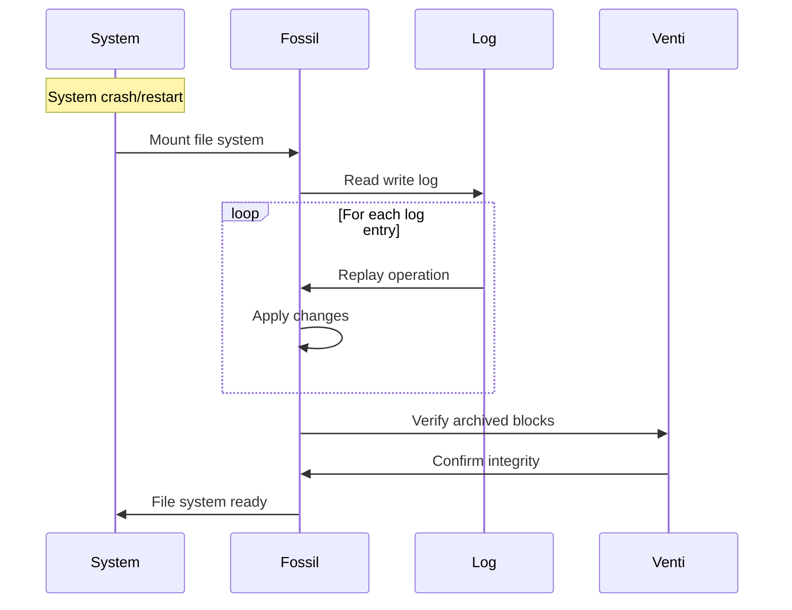

## Tools and Utilities

### File System Tools

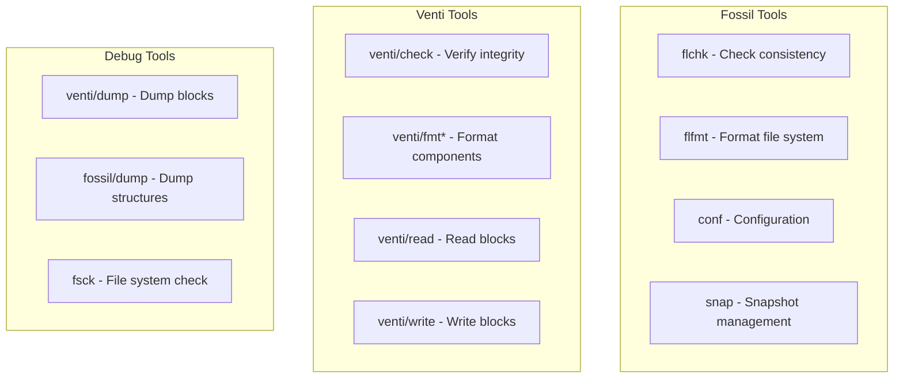

### Administrative Commands

| Tool | Purpose | Usage |
|------|---------|-------|
| `fossil/conf` | Configure fossil | `fossil/conf /dev/fscons` |
| `fossil/flchk` | Check consistency | `flchk /dev/fossil` |
| `venti/buildindex` | Rebuild index | `buildindex venti.conf` |
| `venti/checkindex` | Verify index | `checkindex venti.conf` |
| `fossil/snap` | Manage snapshots | `snap -a archive` |

## Integration with Plan 9

### File Server Integration

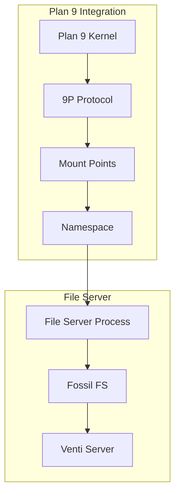

### Network File Access

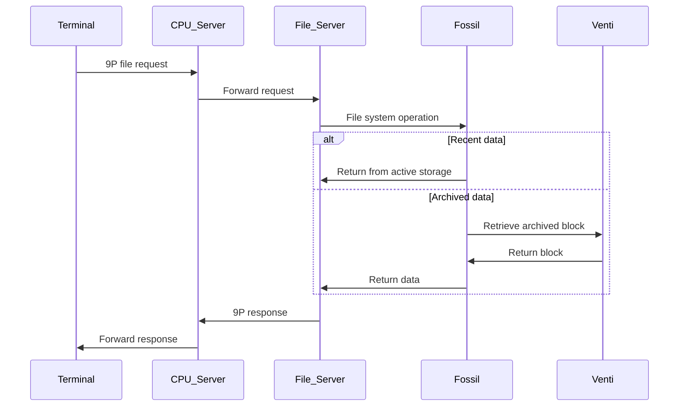

## References

- `/sys/doc/fossil.ms` - Fossil File System paper
- `/sys/doc/venti/` - Venti documentation  
- `/sys/man/4/fossil` - Fossil manual page
- `/sys/man/8/venti` - Venti manual pages
- `/sys/src/cmd/fossil/` - Fossil source code
- `/sys/src/cmd/venti/` - Venti source code