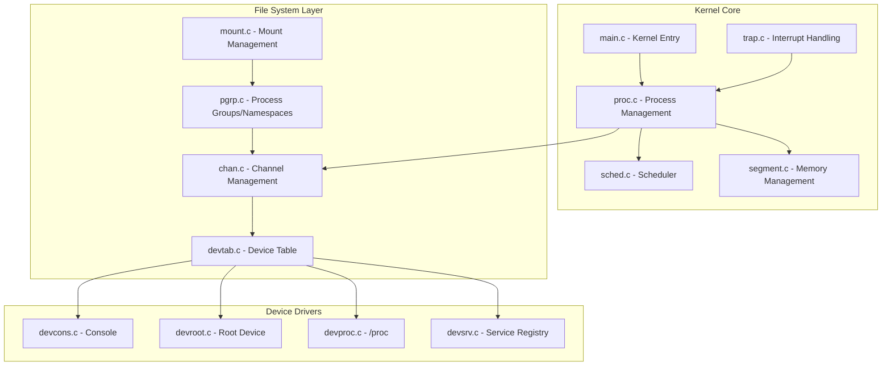
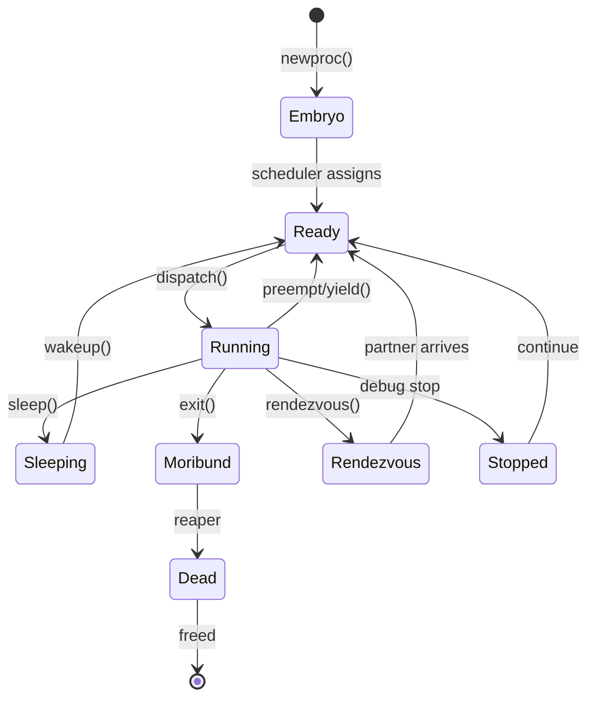
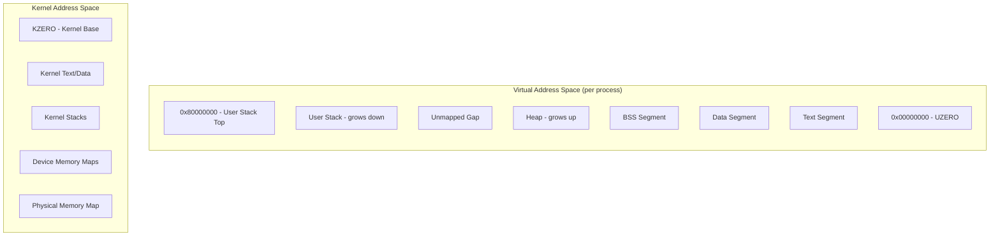
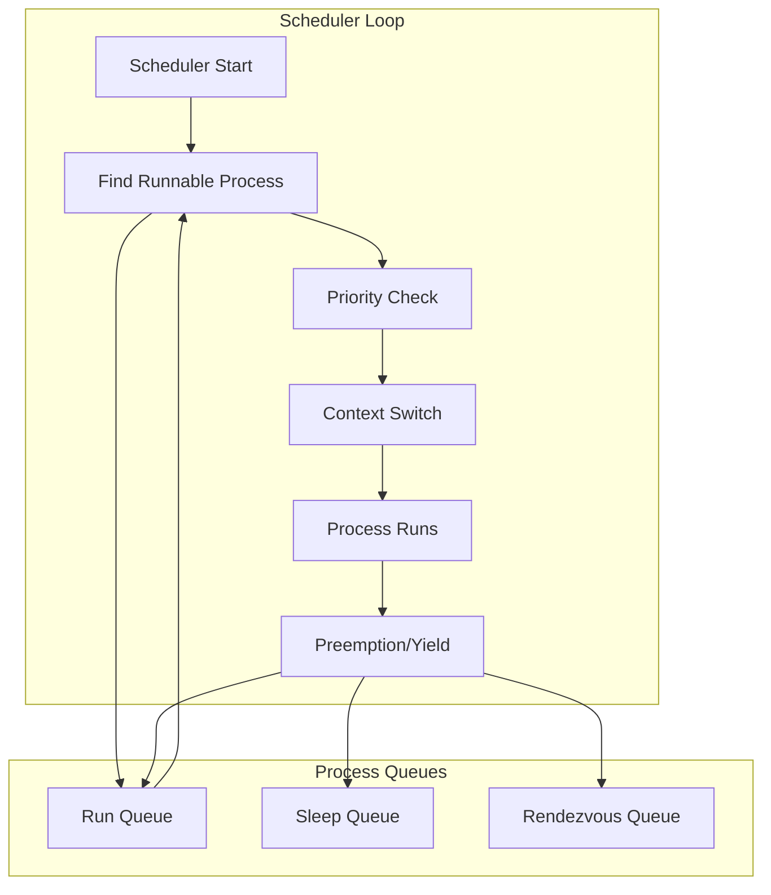
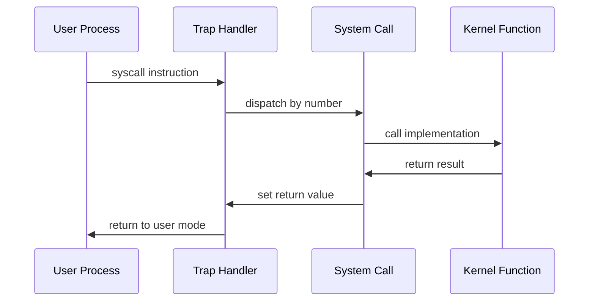

# Plan 9 Kernel Architecture

## Overview

The Plan 9 kernel implements a minimal microkernel-style architecture focused on providing process management, memory management, and device abstraction through the file system interface.

## Kernel Structure

### Core Components



## Process Management

### Process States



## Memory Management

### Address Space Layout



## Device Management

### Device Interface

```mermaid
graph LR
    subgraph "System Calls"
        OPEN[open()]
        READ[read()]
        WRITE[write()]
        CLOSE[close()]
    end
    
    subgraph "Name Resolution"
        WALK[namec()]
        CHAN[Channel]
        CDEV[cdevsw[]]
    end
    
    subgraph "Device Operations"
        DEVOPEN[devopen()]
        DEVREAD[devread()]
        DEVWRITE[devwrite()]
        DEVCLOSE[devclose()]
    end
    
    OPEN --> WALK
    READ --> CHAN
    WRITE --> CHAN  
    CLOSE --> CHAN
    
    WALK --> CHAN
    CHAN --> CDEV
    CDEV --> DEVOPEN
    CDEV --> DEVREAD
    CDEV --> DEVWRITE
    CDEV --> DEVCLOSE
```

## Scheduling

### Scheduler Algorithm



## System Calls

### System Call Interface



## References

- `/sys/src/9/port/` - Portable kernel source
- `/sys/src/9/pc/` - PC-specific kernel code  
- `/sys/man/2/` - System call manual pages
- `/sys/man/3/` - Device driver manual pages