# Plan 9 Networking Architecture

## Overview

Plan 9's networking architecture is designed around the principle of network transparency, where network resources appear as files in the local namespace. The system supports multiple protocol stacks including its native IL protocol and standard TCP/IP.

## Network Stack Architecture

### Protocol Stack Overview

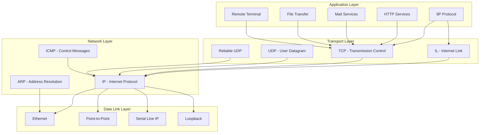

## IL Protocol (Internet Link)

### IL Protocol Features

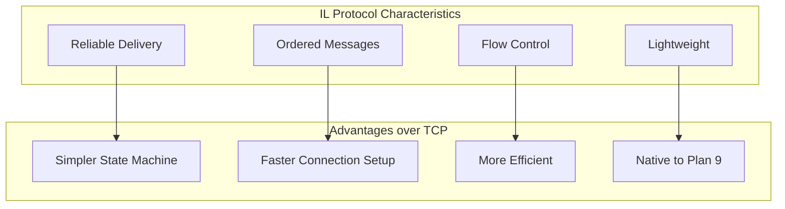

### IL Message Format

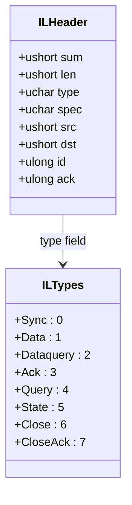

### IL State Machine

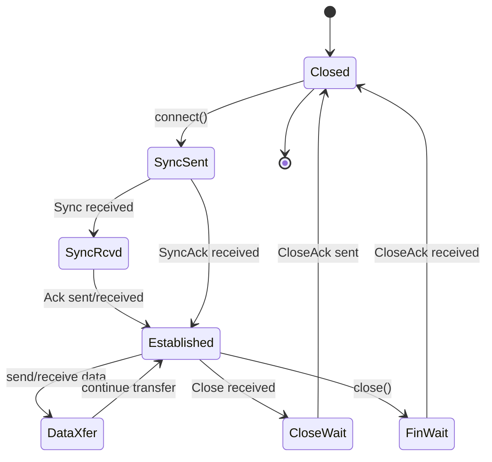

## Network File System Interface

### /net File System Structure

```mermaid
graph TB
    subgraph "/net File System"
        NET[/net]
        TCP[/net/tcp]
        UDP[/net/udp] 
        IL[/net/il]
        ETHER[/net/ether0]
        ARP[/net/arp]
    end
    
    subgraph "Connection Directories"
        TCPCONN[/net/tcp/0, /net/tcp/1, ...]
        UDPCONN[/net/udp/0, /net/udp/1, ...]
        ILCONN[/net/il/0, /net/il/1, ...]
    end
    
    subgraph "Connection Files"
        CTL[ctl - Control]
        DATA[data - Data transfer]
        LOCAL[local - Local address]
        REMOTE[remote - Remote address]
        STATUS[status - Connection status]
    end
    
    TCP --> TCPCONN
    UDP --> UDPCONN
    IL --> ILCONN
    
    TCPCONN --> CTL
    TCPCONN --> DATA
    TCPCONN --> LOCAL
    TCPCONN --> REMOTE
    TCPCONN --> STATUS
```

### Network Programming Model

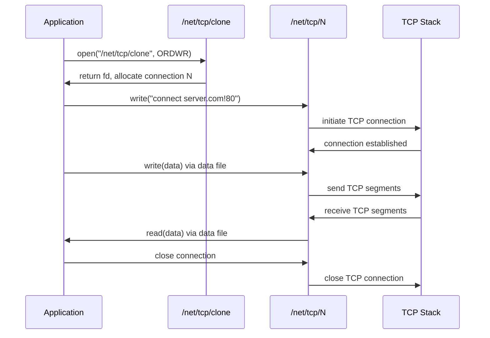

## Network Configuration

### Network Database Structure

```mermaid
graph TB
    subgraph "Network Database Files"
        LOCAL[/lib/ndb/local]
        COMMON[/lib/ndb/common]
        HOSTS[/sys/lib/ndb/hosts]
    end
    
    subgraph "Database Entries"
        SYS[sys= entries]
        DOM[dom= entries]  
        IP[ip= entries]
        NET[ipnet= entries]
        AUTH[auth= entries]
    end
    
    subgraph "Services"
        CS[cs - Connection Server]
        DNS[dns - Name Server]
        DHCP[dhcp - DHCP Client]
    end
    
    LOCAL --> SYS
    LOCAL --> DOM
    LOCAL --> IP
    COMMON --> NET
    
    SYS --> CS
    DOM --> DNS
    IP --> CS
    NET --> DHCP
```

### Sample Network Configuration

```
# /lib/ndb/local
sys=auth dom=example.com ip=192.168.1.1 ether=00:1b:21:12:34:56
    auth=auth fs=fs cpu=cpu
    dns=192.168.1.1

sys=fs dom=example.com ip=192.168.1.2 ether=00:1b:21:12:34:57
    fs=fs

sys=cpu dom=example.com ip=192.168.1.3 ether=00:1b:21:12:34:58  
    cpu=cpu

ipnet=lan ip=192.168.1.0 ipmask=255.255.255.0
    ipgw=192.168.1.1
    dns=192.168.1.1
```

## Connection Server (cs)

### Connection Resolution

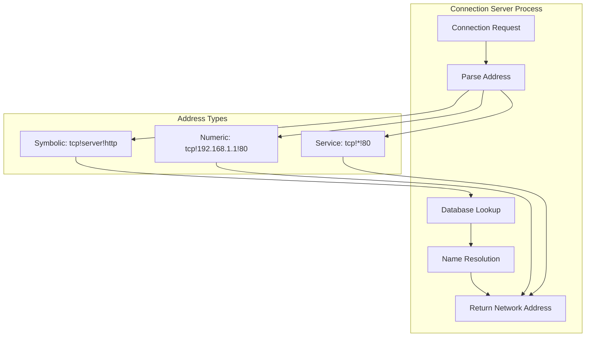

### cs Operation Flow

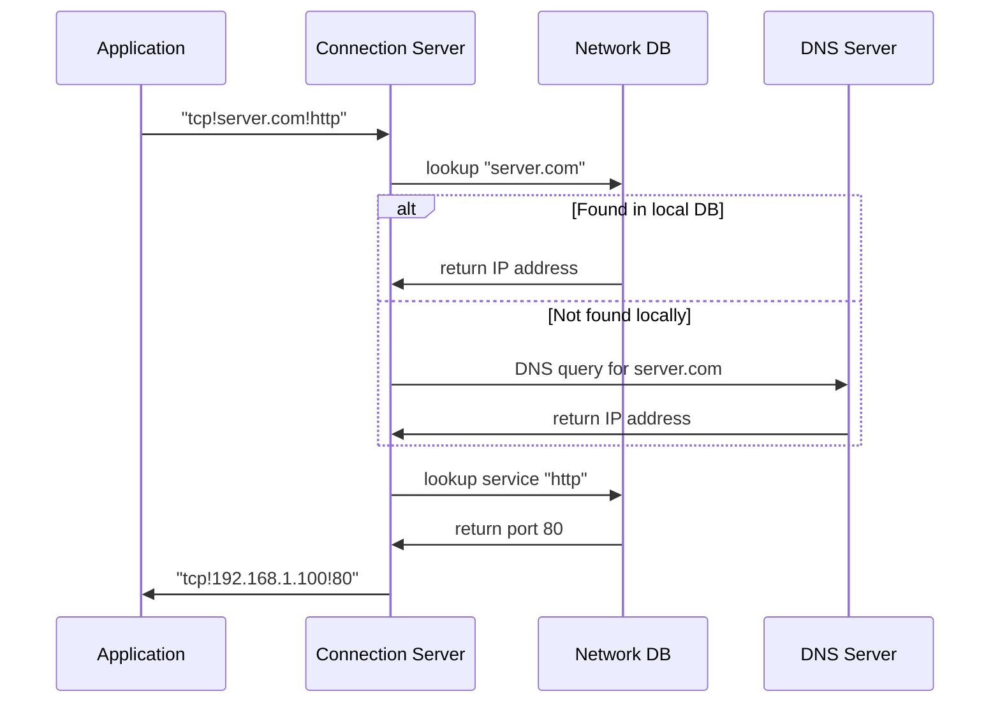

## DNS Resolution

### DNS Architecture

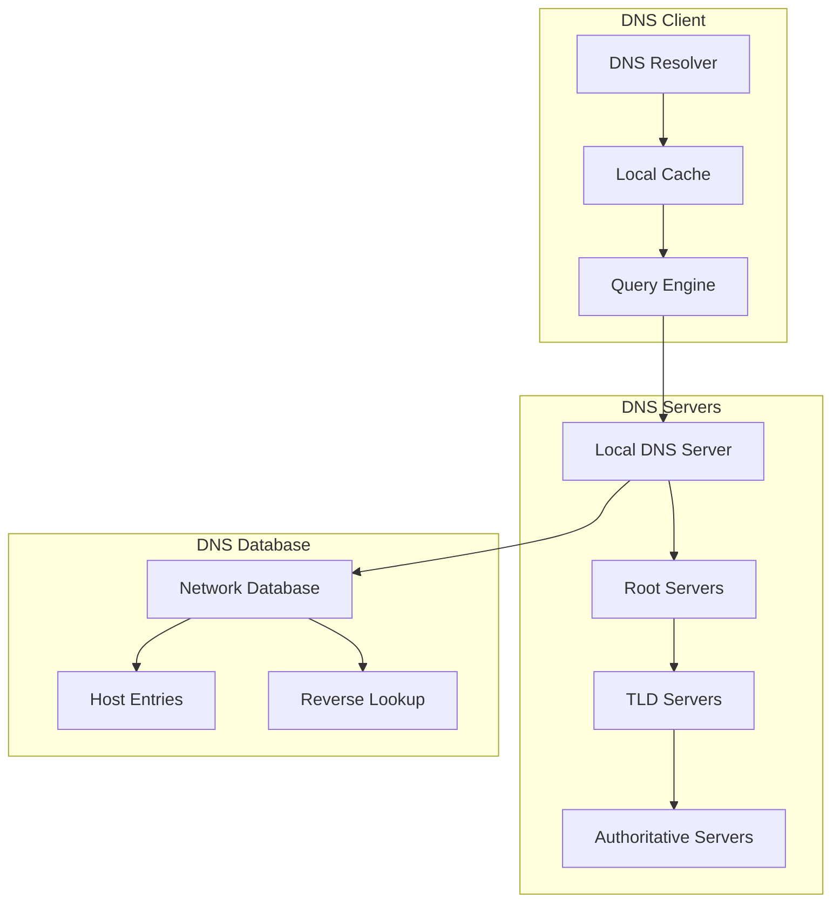

### DNS Query Process

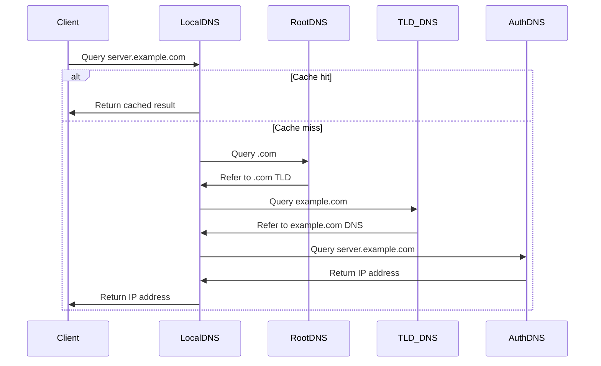

## Network Services

### Core Network Services

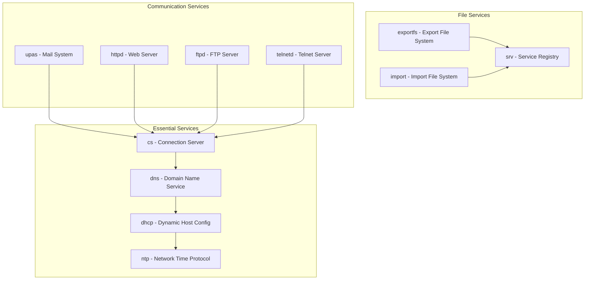

### Service Discovery

```mermaid
graph TB
    subgraph "Service Registry"
        SRV[/srv Directory]
        SERVICES[Service Files]
        ANNOUNCE[Announced Services]
    end
    
    subgraph "Service Types"
        FS[File Systems]
        AUTH[Authentication]
        PRINT[Print Services]
        CUSTOM[Custom Services]
    end
    
    SRV --> SERVICES
    SERVICES --> ANNOUNCE
    
    ANNOUNCE --> FS
    ANNOUNCE --> AUTH  
    ANNOUNCE --> PRINT
    ANNOUNCE --> CUSTOM
```

## Network Security

### Firewall and Filtering

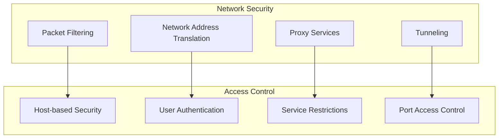

### Network Authentication

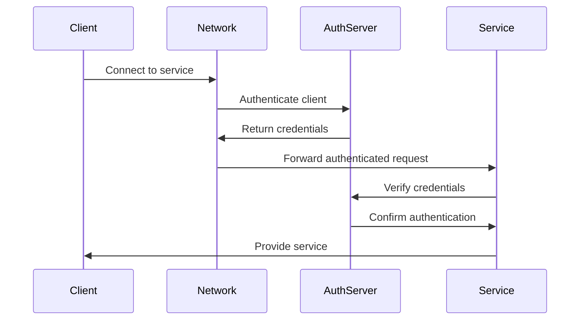

## Performance and Optimization

### Network Performance Tuning

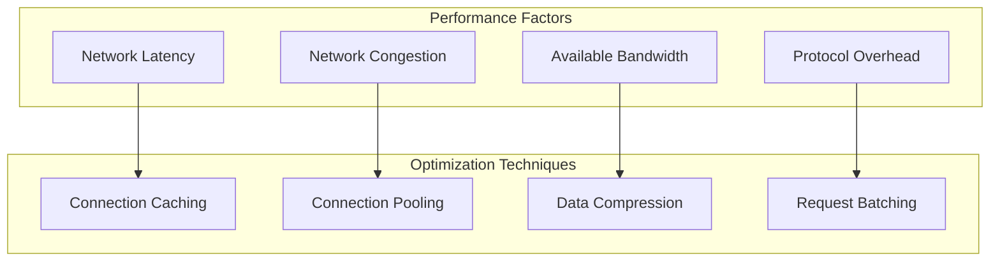

### Network Monitoring

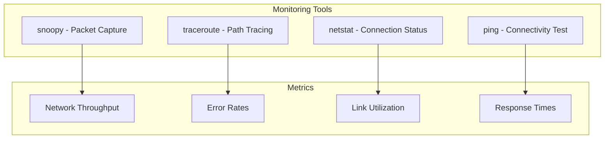

## Distributed Computing Model

### Resource Sharing

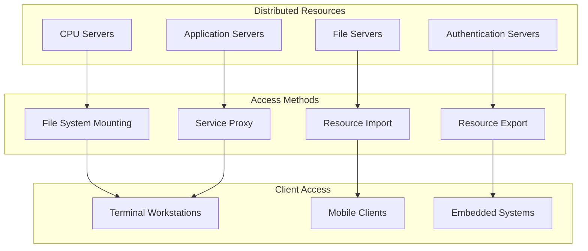

### Load Balancing

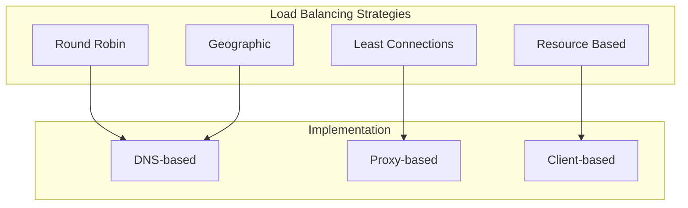

## Network Troubleshooting

### Diagnostic Workflow

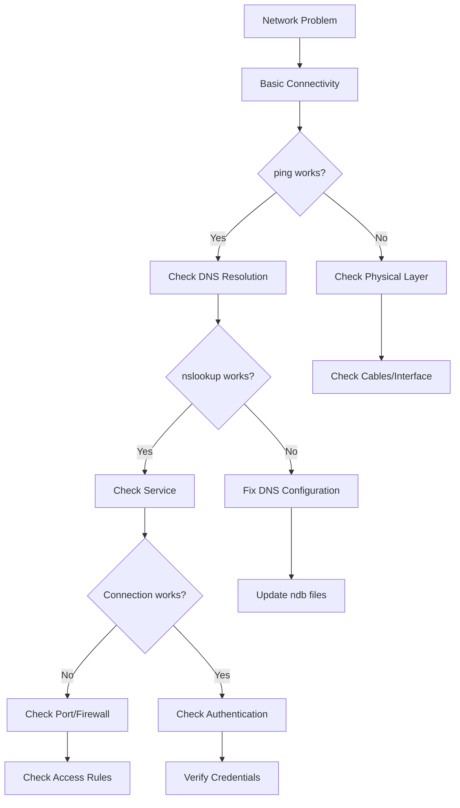

### Common Network Commands

| Command | Purpose | Example |
|---------|---------|---------|
| `ping` | Test connectivity | `ping server.com` |
| `traceroute` | Trace network path | `traceroute server.com` |
| `netstat` | Show connections | `netstat -n` |
| `nslookup` | DNS lookup | `nslookup server.com` |
| `snoopy` | Packet capture | `snoopy -f tcp host server.com` |
| `cs` | Connection server | `cs` |
| `dns` | DNS server | `dns -r` |

## Integration with Plan 9

### Network Namespace Integration

```mermaid
graph TB
    subgraph "Process Namespace"
        ROOT[/]
        NET[/net]
        MOUNT[Mount Points]
        UNION[Union Directories]
    end
    
    subgraph "Network Resources"
        LOCAL[Local Network]
        REMOTE[Remote Networks]
        SERVICES[Network Services]
        DEVICES[Network Devices]
    end
    
    NET --> LOCAL
    MOUNT --> REMOTE
    UNION --> SERVICES
    ROOT --> DEVICES
```

### 9P over Network

```mermaid
sequenceDiagram
    participant Client
    participant Network
    participant Server
    participant FileSystem
    
    Client->>Network: 9P request over TCP/IL
    Network->>Server: Forward 9P message
    Server->>FileSystem: Process file operation
    FileSystem->>Server: Return result
    Server->>Network: 9P response
    Network->>Client: Forward response
    
    Note over Client,FileSystem: Transparent network file access
```

## References

- `/sys/doc/net/` - Network documentation
- `/sys/man/3/ip` - IP stack manual pages
- `/sys/man/8/dhcp` - DHCP configuration
- `/sys/src/9/ip/` - Network stack source code
- `/lib/ndb/` - Network database files
- `/sys/log/` - Network service logs